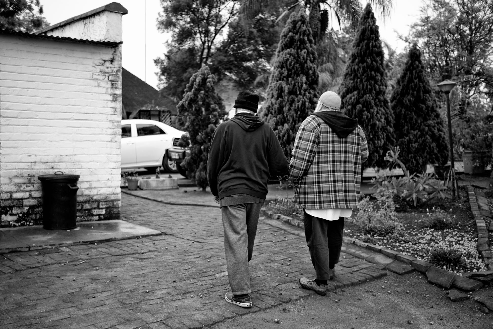

# Binary Experience

It’s all done.   
   
In fact, gone   
from where it had come.   
The immovable now   
ever present,   
constant,   
hiding behind change.   
   
Its end before the start,   
death with birth,   
inseparable,   
disguised as duality,   
clamouring to return   
to Mother Unity   
where all is done   
before any action,   
actor, stage,   
or the idea of unity.   

