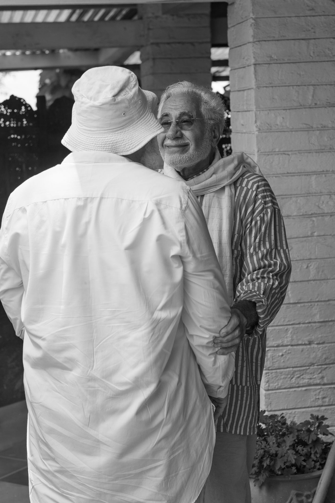

# The Passage of Time

The day flashes by   
in and out,   
dances about,   
to the instant tune of Time.   
Silhouetted on the screen of illusion,   
slipping down the sand dune of existence,   
perched on the edge of a vast desert   
the infinite non-existence.   
But for he who seeks the Truth   
Time is long and tedious,   
for where is its beginning   
and where is its end?   
For the common man   
Time is to be conquered,   
to be killed.   
   
Killing the stranger,   
killing the nomadic tribe,   
wandering here and there,   
sometimes staying long   
sometimes short – all relative!   
Challenging the fixed city   
with its structures and rules,   
its sand and earth are veiled by asphalt.   
But how to stop the shifting sand   
covering the globe,   
the movement of the hour glass   
or the darting electron?   
So fast yet still.   

