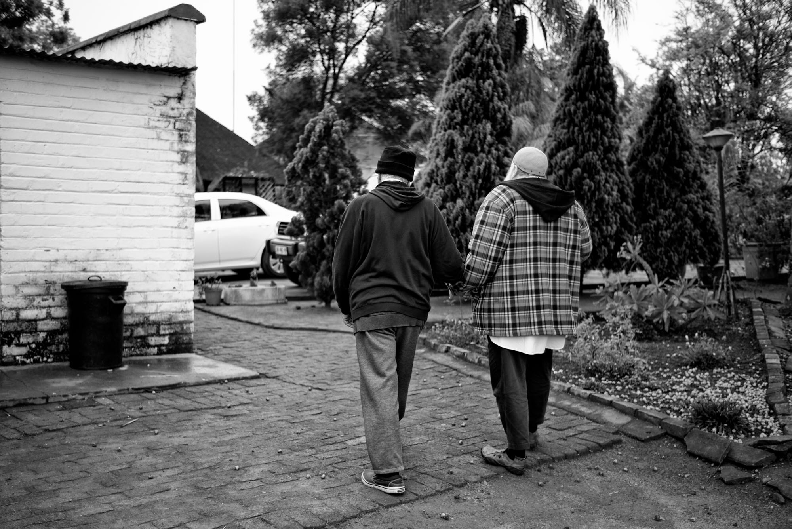

title: Binary Experience

# Binary Experience

_By Shaykh Fadhlalla Haeri, from the book "The Four Journeys"_.

It’s all done.

In fact, gone
from where it had come.
The immovable now
ever present,
constant,
hiding behind change.

Its end before the start,
death with birth,
inseparable,
disguised as duality,
clamouring to return
to Mother Unity
where all is done
before any action,
actor, stage,
or the idea of unity.

