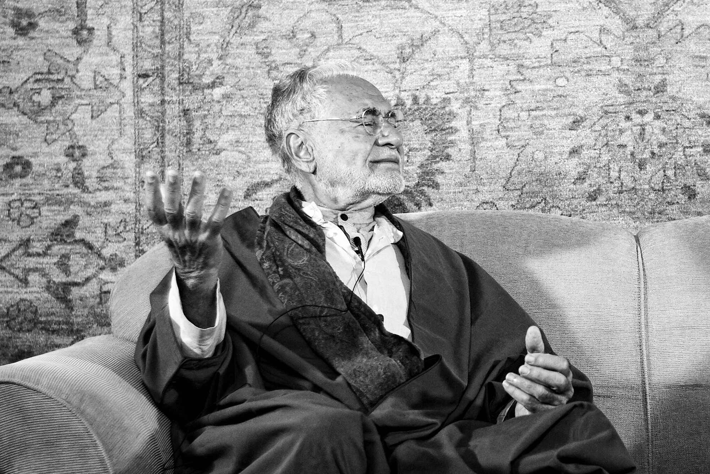

title: This City Has No Roads

# This City Has No Roads

_By Shaykh Fadhlalla Haeri from the book “The Four Journeys”_

When you are in despair  
like a dolphin high on a beach  
its navigation system broken down  
with no possibility of repair.
    
Now, give up!
    
Nowhere to turn,  
no hope for any place or time.  
Not tomorrow or next year.  
Then somewhere, somehow  
the instant may reveal itself  
by itself,  
through no effort  
other than helplessness.  
  
You come to know instantly  
the meeting point of here and there,  
beyond the roads  
and before the travel was invented.  
  
For when thirst was created  
so too was the eternal spring  
in need of reaching thirsty lips,  
to be acknowledged  
grateful,  
heartful,  
hopeful.  
  
