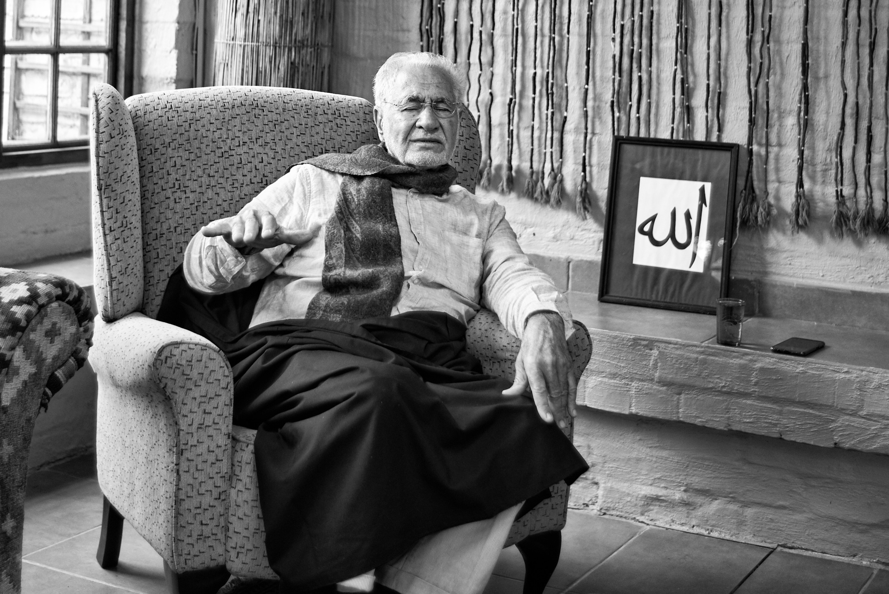

# Enlightened Teachers

_By Shaykh Fadhlalla Haeri from the book “The Four Journeys”_

The awakened beings  
look out for true seekers  
and teach,  
to their inner hearts  
they reach.  
They do not preach.  
  
Meanwhile they,  
like everybody else,  
experience constant change  
and uncertainty,  
while anchored in  
inner constancy,  
their contented heart at peace.  
  
The world does not possess them,  
though they may possess it.
Their mistakes inconsequential,  
their subtle achievements monumental,  
with their followers gentle,  
their love for life ample,  
their lifestyle simple,  
towards their Creator most humble.  
  
So listen attentively…  
if you find such a being,  
make a real commitment  
secure and deep,  
and of enlightened wisdom  
absorb and keep.   
  
Be in this company  
with no condition,  
seeking permission  
at the door of illumined transmission.  
  
