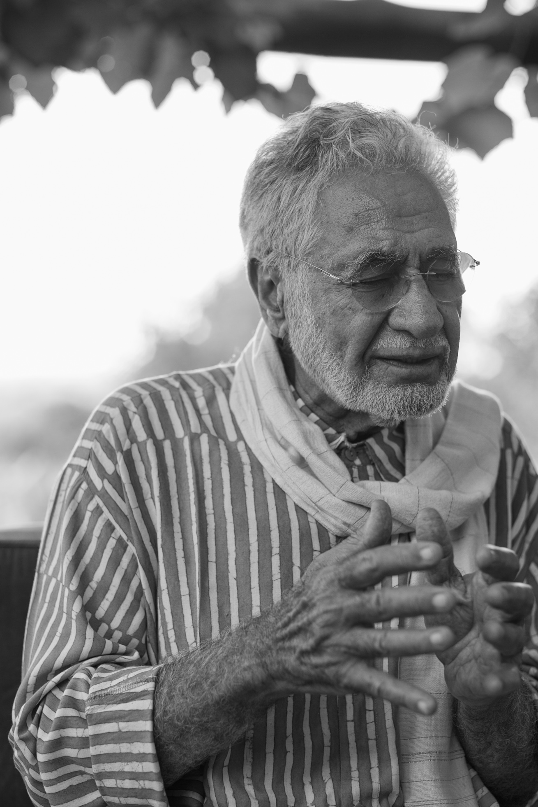

# The First Journey

_Taken from “The Four Journeys” by Shaykh Fadhlalla Haeri_

With disappointment  
fear,  
anger and strife  
there is some hope  
for a better life;  
if not soon  
it may be in the afterlife.  
  
We wish to leave behind  
whatever caused harm  
looking forward to  
liberation,  
peace and joy.  
  
This is the hopeful path  
from creation to Creator,  
but be warned  
for near the end  
there is no way  
to return.  

