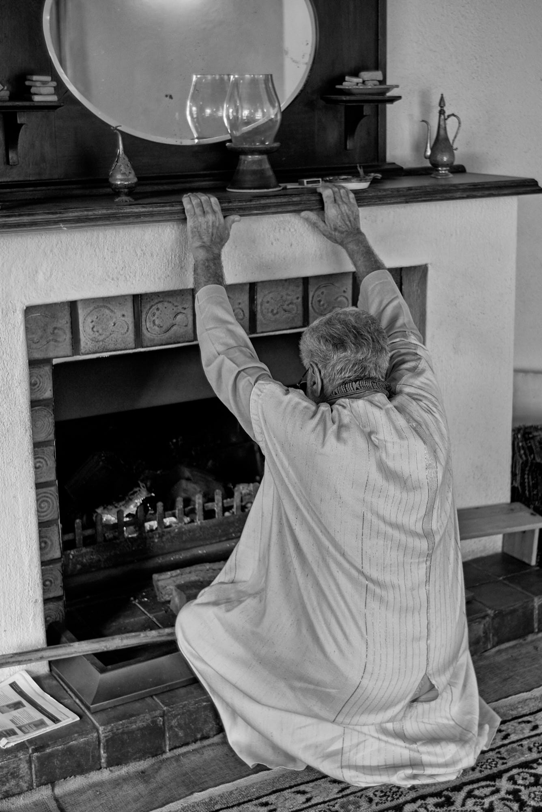

title: Human Modesty

# Human Modesty

When asked, “What do I control?”  
I knew the trick,  
“Nothing!”  
and then again, “What do you want?”  
  
My pretending smile,  
concealed a million desires, some new, fresh.  
Others ancient, lost in the storms of timeless cosmic dust.  
  
Then again, “How much?”  
the sky is vast, my passions too.  
  
Fireballs, hidden behind rose bushes.  
Truth within falsehood.  
Polite.  
  
Friendly gestures,  
taught by a hyena.  
Circus trained,  
by robot monkeys.  
Dressed up as instructors,  
self assured.  

