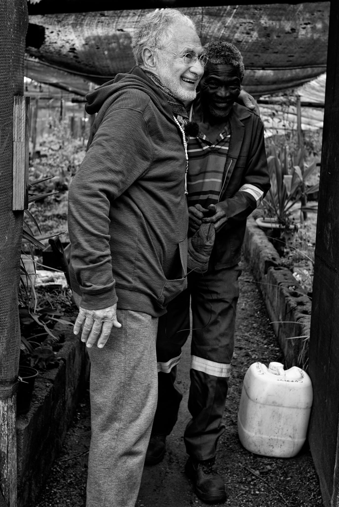

title: Poetry

description: Overview of Poetry Section

# Poetry

**What Is It?**

[Read It](./what-is-it)

**Step With Caution**

[Read It](./step-caution)

**Binary Experience**

[Read It](./binary-experience)

**Morning in the Plantation**

[Read It](./morning-plantation)

**Human Modesty**

[Read It](./human-modesty)

**The Candle**

[Read It](./the-candle)

**Perpetual**

[Read It](./perpetual)

**Big Questions**

[Read It](./big-questions)

