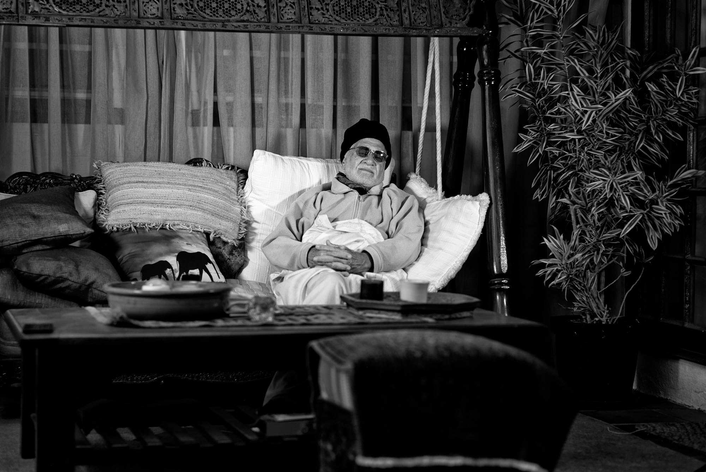

# Sleepwalking

_Taken from “The Four Journeys” by Shaykh Fadhlalla Haeri_

“I am normal,” the voice declared.  
“Leave me to sleep  
for this is my real condition.  
Do not discuss or fuss,  
condemning my wide open eyes,  
your label of ‘wakefulness’  
falls on a frozen courtyard.  
My open eyes simply remind me  
of yesterday  
and tomorrow,  
forgetting now.  
lost between the veils  
of past and future,  
lost in dreams.”  
  
“So please do not discuss or fuss  
the blind misleading the blind,  
dreaming within a dream  
with no dawn or dusk.  
That too, I am told,  
is the real condition  
of those in addiction.  
Then I hear there are others  
considered awakened,  
not in stupor or sleep.  
I am told there are others  
besides us common sleep-walkers,  
but I am not amongst them.”  

