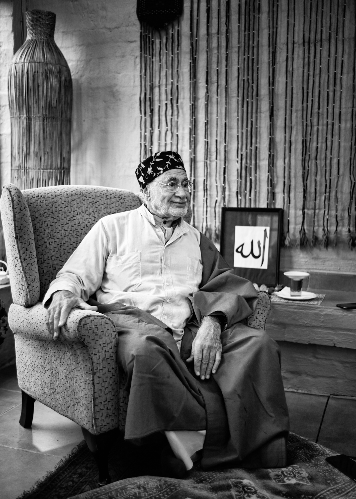

title: The Candle

# The Candle

Who can I trust?  
Where do I belong?  
Who is worth it?  
How can I become One?  
  
The wax was now soft,  
But the wick still hidden.  
The head had to be cleared.  
Then by grace, the wick was alight.  
  
Flickering with new life,  
Announcing its light.  
Just Real.  
Illumining presence.  
  
Perfection in sight and insight.  
Perfect timelessness.  

