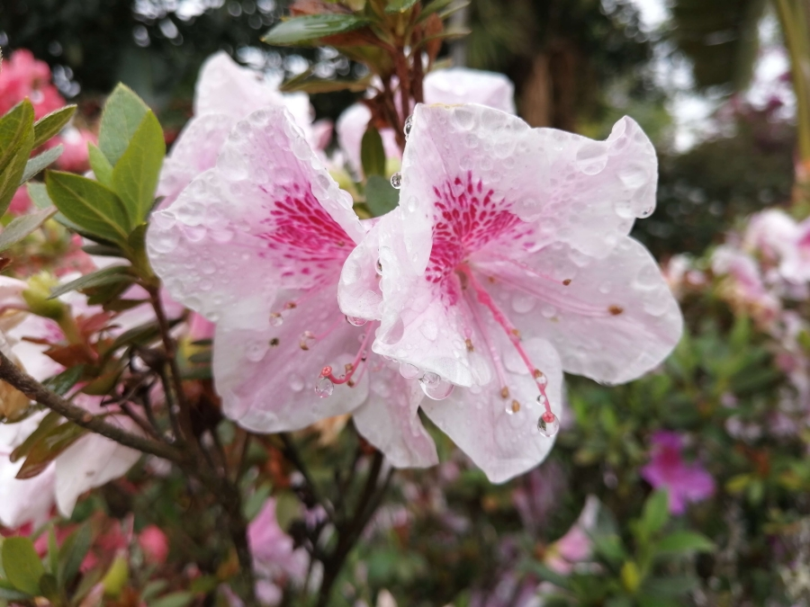

title: What Is It?

# What Is It?

_By Shaykh Fadhlalla Haeri, from the book [“Look Again”](../../books/practices-teachings/look-again)_.

Expressed  
by light, colour and form  
movement and vibration  
presenting itself  
through constant change  
and transformation  
revealed as new existence  
visible and hidden  
emanating  
from essence —  
that which Is  
perpetual  
That is what it is  

