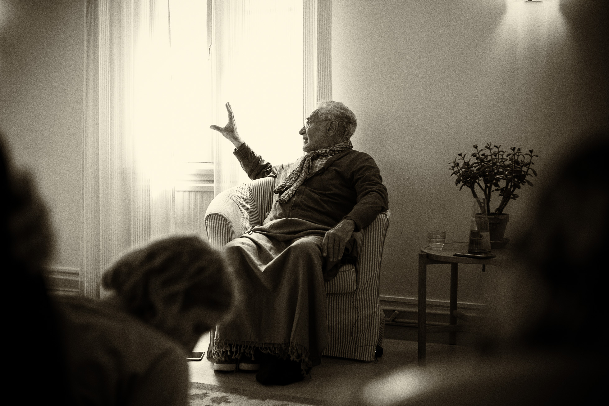

# Maps & Models of Self Unfoldment

**Note**: _We recommend that you read the article [Less is More](../../articles/less-is-more) and reflect fully on it before you go through these descriptions. This article is an extract from the book <a href="https://zahrapublications.pub/book-TheJourneyOfTheSelf.php#bookTitle" target="_blank">"Journey of the Self"</a>._

## The Four Journeys

Another model of the journey of the self is given by the great Sufi master, Mulla Sadra. He uses the analogy of the wayfarer to describe any human's journey from the state of ignorant darkness to one of illuminated awareness. In this model he describes the four stages of unveilings along the journey. It begins when a human reaches a point where s/he realises there is no lasting fulfillment in the existential, changing world.

We all experience at different times in our life the desire for tranquility and seclusion. When worldly difficulties and failures mount, we may wish to leave it all. Many of us go through a period when the monastic life seems an appropriate refuge and it is during these times that we want to turn our backs on creation. It is often at times of the greatest difficulty and confusion that we turn towards the path of discovery of the source in order to understand the position we have landed in. It is when the actors in the play begin to question the plot that we seek to know the author and ask for an explanation.

When we reach this point and realise that there can be no lasting fulfillment in the existential, changing world, we take flight to the edge of the known, which is the unknown dimension. Here the first stage of unveiling begins.

The four stages which follow illustrate the main stations that the successful wayfarer attains in his/her journey. Throughout life, s/he will continue to experience the entire spectrum of states to varying degress of intensity. What Mulla Sadra wishes to emphasise here is the established station that the wayfarer attains, rather than simply the passing, temporary state which s/he will continue to experience from time to time in life.

### The First Journey: From Creation to Creator

The first barrier to cross, or the first unveiling, is from the creation to the Creator. The wayfarer flees from the confusing, physical and material universe of opposites to another dimension - the dependable, real and reassuring world of the unified field of reality. The silence within is the knock on the inner door.

The unveiling of the first barrier involves tearing away veils both of darkness and light that exist between the seeker and the spiritual reality within. Then the ascent can begin from the station of the lower self to the station of the intellect, and from the station of the intellect to the the station of the spirit, and from the station of the spirit to the farthest goal of supreme splendour. If the wayfarer succeeds in reaching this goal, the final veils are lifted and s/he is annihilated by the death of the transitory, dissolved and submerged in the divine source.

### The Second Journey: With the Creator by the Courtesy of the Creator

The second unveiling is the journey across the barrier to knowledge of the Creator. The wayfarer is now exposed to Reality by the courtesy of Reality. S/he moves totally in the inner realm. S/he attains gnosis. His/her essence, attributes and actions become annihilated in the divine essence. In this journey, s/he sees through His seeing, hears through His hearing and knows through His knowing.

When the inner journey and discoveries are taking place, the wayfarer looks for greater confirmation of these openings. S/he is like someone who discovers that s/he is truly a guest, and that the Host is most generous and understanding. The wayfarer then hopes for this condition to last and to remain in this refuge. As though s/he sees his/her image in a mirror for the first time. s/he seeks confirmation and establishment of what s/he has seen.

### The Third Journey: From the Creator to Creation by the Permission of the Creator

The completion of the second unveiling marks the start of the third journey. In this, the wayfarer returns from the Creator back to creation by the permission of the Creator. In this journey, s/he is armed with the knowledge of truth.

The wayfarer's state of self-annihilation is complete and s/he now attaines full sobriety and balance. S/he subsists through the subsistence of the Creator. S/he returns to creation by the authority of the Creator with the knowledge of the unveiling.

The nature of life does not change and it carries on with its ups and downs. There is no avoidance by anyone of experiencing these outer waves which occur at the surface above the still depths of the ocean. So when the wayfarer is established in his station, s/he returns to creation with all its turmoil. However, the wayfarer, because of his/her knowledge of the nature of the ocean, is now far more able to deal with its changing surface. The waves are of little signficance and the storms are relative puffs of wind compared to the stable mass of the deep.

### The Fourth Journey: With Creation by the Authority of the Creator

The wayfarer then embarks upon the fourth stage, which is to be among creation by the autority of the Creator, when nothing else remains but service in the bliss of knowledge. the seeker observes and recognises creation and humanity, their behaviour and needs. S/he knows the good that they bring about and the evil that they cause, and what causes them happiness and what brings misery.

In all this, s/he is with the truth, for his/her entire being has been submerged in reality, and the service rendered by him/her to other beings does not distract from the inner divine bliss, steadfastness and certainty. The fully realised being is now in the ultimate unitive state. S/he is completely in outer service of humanity and in inner abandonment, freedom and joy.

When reality in all its various aspects is unveiled to the wayfarer and s/he is established in the knowledge of truth within, a new outlook towards creation emerges. The awakened being sees the divine thread through all existence and therefore is qualified to serve with selflessness, with no danger to creation or to themself. When the individual self has aligned itself with original unified reality, the flowering of the spiritual being has occurred. It is this unveiling that is referred to as "with creation by the authority of the Creator." Wherever the enlightened being looks, he sees the trace and the mark of the Creator. S/he is now an agent of transformation, a loyal slave to the Divine Master and a freed being with no choice but to reflect what comes to his/her pure heart. This is the state of a prophet with the people - outwardly the same as any of them, inwardly turned to the eternal origin.

