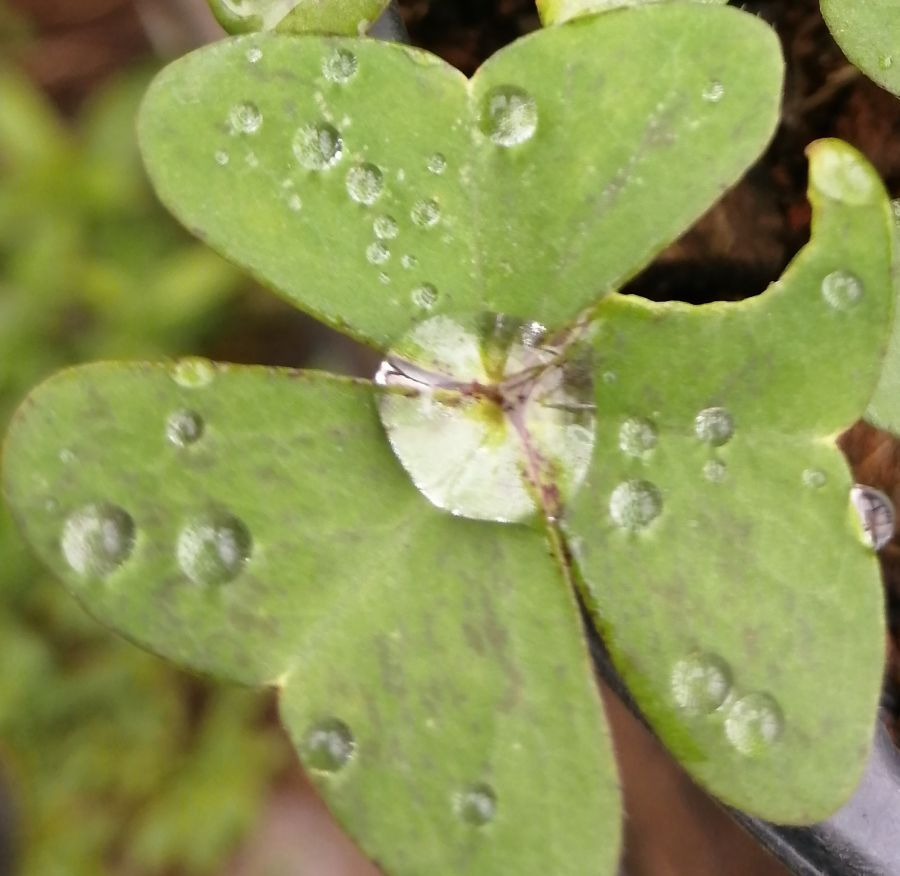

# Pointers to Practice

The more often you calibrate your overall state with death or the hereafter, the more likely you are to experience a good life.

**Specific Practices**

Practice stillness and recalibrate regularly with silence. Exercise genuine honesty and humility, so as to find the correct balance between head and heart, which can lead to a truly neutral state from which to begin moving into more subtle zones of awareness.

[Read More](./practice/)

**Maps & Models of the Self**

A basic mapping of the modern self and the journeys it can undergo in this life as it progresses through various layers or rungs of consciousness.

[Read More](./4-journeys)

**Vices, Virtue and Appropriate Conduct**

Virtue is behaviour occurring at the centre of two extremes, both of which are unvirtuous. From this base, Shaykh Fadhlalla explores loyalty, higher consciousness and the eternal now.

[Read More](./vice-virtue-appropriate-conduct)

**Self Knowledge and Unfolding Into Presence**

A collection of excerpts from various books written by Shaykh Fadhlalla over the years on the theme of Self Knowledge, Presence, and how to deepen one's practice of both.

[Read More](./self-knowledge-presence)

