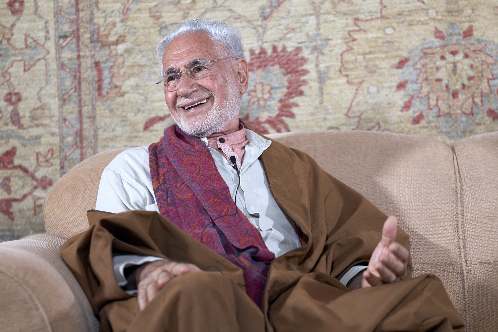

# Virtuous Being and Higher Conduct

Daily needs and rationality are healthy diversions from the intensity of Reality or Truth, for it is so powerful that we need diversions.

We often experience disappointment and frustrations. We also too often feel trapped, confused or lost. Why are we constantly faced with these challenges? This is due to the limitations of conditioned consciousness and ego. Between birth and death, we play roles in this shadow theatre of life, as we evolve towards our origin.  

Frustrations arise out of the disparity between our higher soul consciousness and the shadow self. How can we refer and calibrate our perceived experience with the constancy of the soul? It is helpful to have a role model, and more helpful to have a trusted teacher who reflects higher consciousness.  

## Virtues and Vices and the Importance of Interaction

_From the book <a href="https://zahrapublications.pub/book-TheJourneyOfTheSelf.php#bookTitle" target="_blank">“The Journey of the Self – A Sufi Guide to Personality”</a>_. 

The importance of virtue to self-development can be seen after defining what is meant by virtue. We define virtue as behaviour occurring at the centre of two extremes, both of which are unvirtuous. The virtuous value which is at the centre is not affected by the unvirtuous values around it unless it moves towards one or the other extremes, away from the centre. When it happens, the virtue takes on the colour of that particular vice. For example, the virtue of generosity is the midpoint between two vices – meanness at one extreme, and indiscriminate giving, or wastefulness, at the other extreme.             

This characteristic of virtue (lying at the centre between vices), becomes practically useful once understood, practiced and perfected in actual life-transaction situations. Interacting and transaction with the extremes is an essential ingredient in acquiring the knowledge of virtues.
Virtues are the outcome of dynamic and active situations involving interaction with other people and beings. In our social exchanges, we will both teach and be taught virtues. Necessarily, we will have to be patient with all the afflictions and setbacks we experience until we perfect our knowledge.

## Loyalty   

To be loyal implies total connection understanding and unity – thus loyalty emanates from the field of Oneness. Can there be loyalty between two changing entities? Can you be loyal to another human being?

Change, uncertainty and the fields of duality are barriers to loyalty. Unless there is one constant reference, loyalty cannot be durable! Unless each entity calibrates with its organic source of Oneness there can be no lasting loyalty. True loyalty to another being can emanate from the original loyalty to the One essence from which all dualities have emanated.         
Loyalty to the One can bring about the experience of being loyal to those seeking the knowledge and experience of the One. 

It is part of human nature to consider loyalty as a good virtue for it contains within it an aspect of Oneness and unity. The purpose of human life is to be in constant reference to the cosmic Oneness – Allah and all his attributes. 

## Higher Consciousness

Higher consciousness is our enduring nature and reality; and the closer we are to it the more we feel secure in its presence.

The zone of higher consciousness is infinite and beyond all descriptions like joy, bliss or happiness. A good example of how to move to higher consciousness is riding a bicycle. You are put on the saddle and somebody pushes you. After a while you learn to balance and you feel you can repeat it on your own. Similarly, you first need a map of Reality, and you then follow the path that may lead to your destination.  

Determination and grace are required to awaken to your Soul. It is when you experience that ever-present Reality, you know that your old self was merely a shadow, of the Real. When you transcend your tyrannical or feral self, you perceive that its role was to cause that suffering and thereby act as a prelude for awakening. Your lower self leads you to your real self – the divine spirit within. Life on earth is a struggle because it is a realm of experience between limitations and limitless Reality. You need help and a guiding hand. You need a reference. You need Grace and perception of the sacred presence.

## Now Is Eternal
       
Identity relates to mind, memory and time. Thoughts connect the past to the present and future. Reflection, meditation and the silent mind enable us to experience the immense present moment – now.  

Much human effort is expended to reduce distance and separation. As for time, we try to go faster than all possibilities or, more effectively, to stop time altogether. Our human conditioned consciousness drives us towards stillness in mind, which opens the door of timelessness and perpetual presence. All human endeavours lead to a point of experience, which occurs when the mind is content and still. The moment of success or heightened pleasure reflects this state. Within the still moment lies the zone of transcendence of mind and time. That is the infinitude of Reality.  

When the past is lost   
and the future is of no concern,    
the perfection of now    
is a great gift   
that yields a lasting thrill.  

