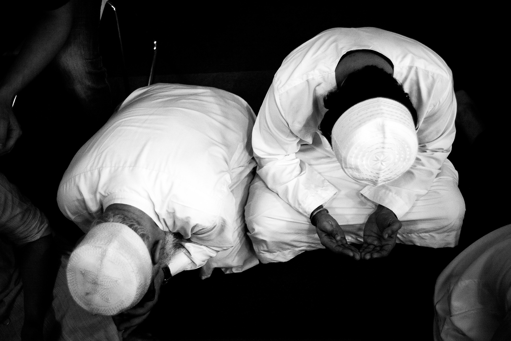

title: Inner abstentions

description: Part 5 of the text series on Fasting, which explores the subtler, inner thoughts, concerns and knowledges we ought to refrain from while fasting.

# Inner abstentions

There are five inner abstentions:

## 1. Worldly Concerns

The First Abstention refers to restraining the mind from being occupied with base or worldly concerns. The mind is where reasoning and intellect are developed for interaction with the world. When used properly they lead to rational and good understanding. The Prophet has taught that the contemplation of one hour is better than the actions of seventy years.

## 2. Useful Knowledge

The Second Abstention is to use the mind and intellect to learn about creation and appropriate boundaries and limitations.

> "…those who preserve Allah’s limits." Qur'an, 9:112

## 3. The Imagination

The Third Abstention involves restraining the imaginal power. In Arabic, this is called the _khayāl_ – the faculty which enables us to construct entities or ideas which do not physically exist, such as a ‘flying cat’. During fasts, we must limit its activites to the purpose for which it was created, which is the perception of things in their true higher reality without being overcome by fantasy and foolish imagery. Allah did not create this power for any reason other than to deduce the meaning behind the world of matter. The power of imagination inspired the Pharaoh and his people to imagine that the transformation of the staff of Musa into a serpent was merely a result of magic.

## 4. Illusions

The Fourth Abstention is restraining the power of illusion (and values or meanings given to events or situations) which makes one hate someone one minute and love someone else the next. This _wahm_ prevents one from steadfastness and perseverance on the path of spiritual evolvement. It will cause one to fall prey to the delusion of love and hate and other confusions.

Whoever possesses a "Tranquil Soul" is free of all of this as he is in the station of witnessing his Beloved and His acts, and "anything the Beloved does is loved". Whoever is in this state of witnessing One Reality has no enmity for anyone nor concern. Allah addresses the one who has attained this station:

> "O soul that art at rest! Return to your Lord pleased [with Him] and well-pleasing [Him]". Qur'an, 89:27-28

Whoever truly fasts is the one who possesses a soul that is at rest or tranquil and is not possessed or controlled by his lower self.

## 5. Combined Senses

The Fifth Abstention deals with restraining the combined senses as they manifest themselves, both in subjective thoughts (_wahm_) and in the imagination, and as they constantly appear to the self in both form and meaning. This is naturally an obstacle to progress on the Path, because anyone who is occupied with the senses is veiled from the real significance that lies behind them.

Likewise, anyone who is preoccupied with their illusions and self-given values will be veiled from true meaning. The "One who is veiled, is veiled, regardless of whether it is by one veil or a thousand." Consequently, the one who fasts must abstain from the likes of these so that he may be free of all veils and witness his Beloved in the manner we have discussed.

## There is Only Allah

The People of Allah consider the self to be like a tree with ten branches. Each branch naturally takes its share of nutrients which the tree imbibes from the earth. If, however, we suppose that nine of these branches are cut off then the power of those branches and the nutrients which originally went to them would now go to the one remaining branch; it would grow larger and its fruit would be sweeter and bigger. So it is with the self of man. If man ceases to be attached to the world which surrounds him and his attachment is to the trunk then no doubt the fruits of his thought will be loftier, greater, more powerful, and more honorable.

The fast of the Gnostic consists of abstaining from witnessing anything other than Allah. Consequently, anyone fasting at this level abstains from anything other than their Beloved, for they assert that there is nothing in existence other than Allah (the Exalted), Allah’s Names, Attributes and Actions; thus, everything relates to Allah, by Allah, and from Allah. This is because anybody who does not restrain his self from witnessing other than Allah is a mushrik, and the fast of the mushrik is not accepted, nor is his prayer, because praying and fasting cleanse the inner from the impurity of seeing another with Allah, and from the illusion of the grossness and the filth of ‘otherness’ with the water of Unity and the light of faith based on knowledge. It is obvious in prayer and other acts of worship that one cannot cleanse the inner unless the outer is cleansed by way of _wudu_ or _ghusl_. Likewise, the fast is not valid for the mushrik, whether his shirk be open or concealed, because every _mushrik_ rejects Reality (i.e. a _kāfir_) and every _kāfir_ is a _mushrik_, as Allah has stated:

> "And whoever associates (others) with Allah has indeed gone far astray." Qur'an, 4:116

The following verse elucidates the meaning of concealed shirk:

> "Thus whoever seeks to meet his Lord then let him do good actions and not associate anyone in the worship of his Lord." Qur'an, 18:110

If this is an allusion to one who was openly associating others with Allah, Allah would have said: ‘…and not associate anyone with his Lord.’ But when He says ‘in the worship of his Lord’ we know that this is an allusion to one who secretly or inadvertently associates others with Allah, who are referred to as being ‘believers’ and ‘Muslims’, as Allah has said:

> "And most of them do not believe in Allah without associating (others with Him)." Qur'an, 12:106

And recall what the Prophet said:

> "The infiltration of shirk into my people is more hidden than the creeping of a black ant upon a black stone on a dark night."

