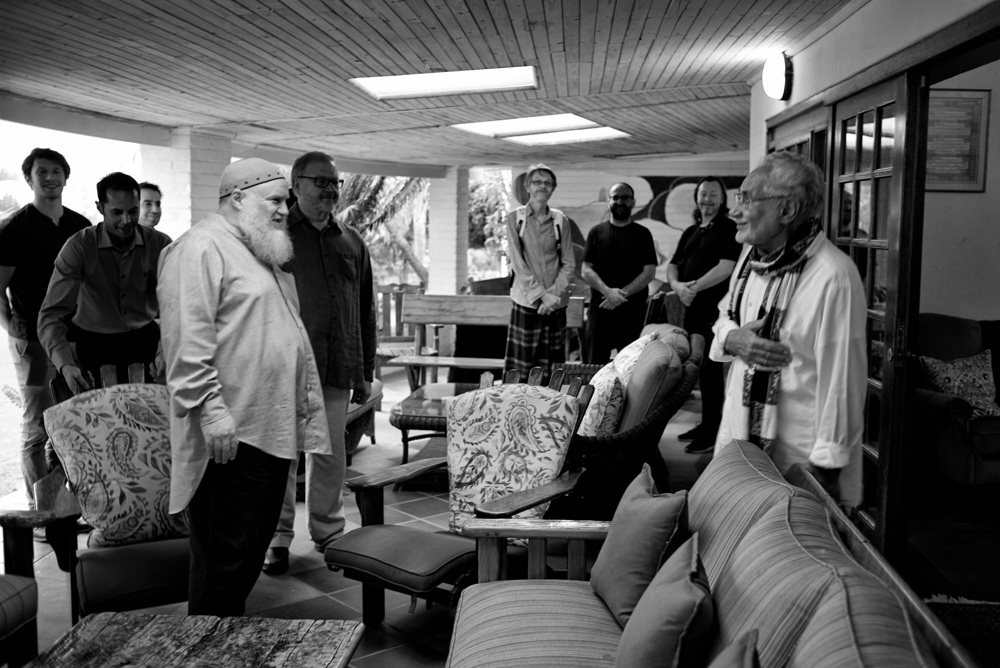

title: The Islamic Fast

description: Part 2 of the text series on Fasting, which explores the practice in a specfically Islamic context.

# The Islamic Fast

For Muslims fasting, or _sawm_ in Arabic, was commanded in the Qur’an as a major obligatory spiritual discipline for the duration of the month of Ramadan. The Arabic word for fasting is derived from the root, ‘sama’, meaning to abstain from food, drink, smoking, sensual gratifications, wrong actions, harmful intentions, thoughts, words and deeds.

Islamic fasting is obligatory for one month in every lunar year, that is, Ramadan, the ninth month in the Islamic calendar. All healthy adults are expected to adhere to the proper rules of fasting. In addition to this obligatory fast, there are many optional fasts, some of which occur regularly every week or month, and some that are scattered throughout the year. These fasts are Sunnah, or the practice of the Prophet. Fasting is also used as a penance for breaking an oath and as a compensation for some other religious obligation.

The fast of Ramadan begins with the physical sighting of the new moon. Throughout the month a Muslim may not eat or drink from daybreak (when a fine strip of light may be seen on the horizon) until the sun has set. Before dawn a small meal (_suhur_) is usually recommended to be taken, although not obligatory, and the fast is broken just before the sunset (_maghrib_) prayer traditionally with dates and water, to be immediately followed by the prayer. Later on a larger meal is partaken by the entire family, often shared with relatives, friends and guests.

The daily fast is begun by formulating the intention to perform the fast as a rite by making a clear intention (niyyah) to observe the fast. No one should fast if their health cannot sustain it or if a fast should threaten one’s health. Pregnant and nursing women whose health may be harmed are exempted, as are those who are travelling away from home. When health is restored or other conditions for not fasting are removed (such as menstruation) then the person is expected to make up the fast later during the course of the year.

## The Opportunity of Ramadan

Ramadan offers the believer an opportunity to mark an end to daily indulgences, or at least to impose clear limits on a daily basis for the duration of a month. This daily restraint breaks the habitual patterns of the self and constitutes a purification both of body and spirit, which brings about renewal of strength and greater spiritual awareness. Each and every ritualistic practice of Islam disciplines the individual and strengthens Muslim society if applied thoroughly.

Every year the month of Ramadan falls at different times because the lunar calendar is shorter than the solar by approximately ten days. This means that as the period of the fast is brought forward annually, Ramadan will fall during all seasons of the year in a gradual progression. Despite the strict rules and restraint induced by the fast, Ramadan is usually a joyful time for Muslims everywhere. The last ten nights of the month, particularly the odd nights, are the spiritual highlights of Ramadan, for one of these nights is Laylat al-Qadr, the Night of Determination, in which the Qur’an was first revealed to the Prophet. During these nights Muslims spend their nights in supplication and prayer, hoping to favorably influence the course of events that will unfold subsequently.

Ramadan comes to a close with the celebrations and prayers of _Eid al-Fitr_. On this day a Muslim will give appropriate alms to the poor, and families gather for a light morning repast after the congregational prayer. The Eid prayer, usually performed outdoors is accompanied by a discourse delivered by the prayer leader after which people exchange good wishes and celebrate their success in performing a most important act of worship and attaining a heightened awareness and purposefulness in life.

The Prophet of Allah said:

> "The root of Islam is prayer, its branches are the obligatory tax, its height is the fast, and its expanse is striving in the way of Allah."

He also said:

> "The tax of the body is fasting."

A Jew who was one of the most learned of his people asked the Messenger of Allah: "Why did Allah make it obligatory upon your people to fast throughout the day for thirty days?" The Prophet replied:

> "When Adam ate from the tree it remained within his stomach for thirty days, so Allah made it obligatory upon his offspring to experience thirty days of hunger and thirst. Whatever they eat at night is a grace from Allah. Thus it was with Adam, so Allah made the same obligatory for my people."

Then he recited the verse:

> "The fast is prescribed for you as it was prescribed for those before you." Qur'an, 2:183

Imam al‑Rida wrote the following concerning the obligation to fast:

> "It is so that one may know the feeling of hunger and thirst, so that he will be humble and helpless, in order to be an indication of the difficulties of the Hereafter. Within it is contained the breaking of desires so that one will experience the deprivations caused by withholding from the poor and the needy."

Imam al‑Sadiq relates that the Prophet said:

> "The fast is a shield, that is, a veil protecting one from the afflictions of the world and from the punishment of the Hereafter. Thus, when you fast, make the intention to restrain your self from its desires and cut off the thoughts inspired by Shaytan. Bring yourself to the place where you are content without the desire for food or drink."

## The Degrees, Purpose, and Reason For Fasting

The purpose of the fast is to deaden the desires of the self; it is a cleansing for the heart and the body and a revival of both the inner and the outer. It also includes given by those who stand in need before Allah gratitude for the grace and goodness bestowed. It increases humility, meekness, and tears, and causes one to seek refuge with Allah.

The reason food is permitted during the night is because Allah does not make one responsible for more than one can endure. Allah has made it easy for us, which is the main characteristic of the _shari`ah_. Previously it has been said that Adam performed his fast in the daytime, that his repentance (_tawbah_) was accepted at the time of the afternoon prayer, and that he was freed of transgression at the time of the sunset prayer. This tradition is observed every day during one month so that during this time one may rid oneself of wrong actions and then be joyous in one’s liberation from them by eating after sunset.

The degrees of fasting can be arranged in the following manner: 

1. The first and lowest of them is that the person fasting limits himself to refraining from those things which would render his fast null and void but not from doing those things which are considered reprehensible. This is the fast of the general masses. 

2. The second is to restrain the body from whatever is considered reprehensible. Consequently, one guards his tongue against slander, his eyes against desire, and so on with the rest of his body. This represents the fast of the people of _tariqah_. 

3. The third, in addition to the above, is to protect the heart from going astray and from the whisperings of Shaytan, limiting it to the Remembrance of Allah and the witnessing of Him in all His manifestations. This represents the fast of the Chosen Few and is perfection itself.

