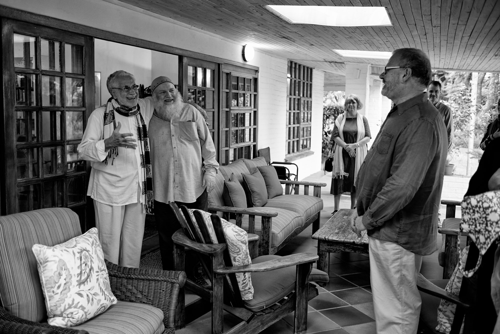

title: The Meaning and Benefits of Fasting

description: Part 3 of the text series on Fasting, which explores the meanings (both inner and outer) and benefits of fasting.

# The Meaning and Benefits of Fasting

To fast is to refrain from specific things during certain specified intervals of time. Among the stipulations in Islam is the soundness of the intention covering a specific time period, for example, the month of Ramadan, or for the purpose of fulfilling an oath (_nadhar_). The intention which specifies the type of fast must also be made at the time when it is begun.

There are various categories of fasts and each has its particular regulations: obligatory fasts, recommended fasts, fasts for specific oaths, and fasts for non‑specific oaths. Those actions which require a fast to be made up (_qada’_) or expiated (_kaffārah_) are nine in number and are as follows (as per the teachings of Ahl ul-Bayt):

1. Eating.
2. Drinking.
3. Sexual intercourse.
4. Intentional ejaculation.
5. Intentionally telling a lie concerning Allah, His Messenger, or the Imams.
6. Complete submersion in water.
7. Intentionally taking in thick dust in the throat (e.g. flour or anything similar).
8. Intentionally remaining in a state of janābah (ritual impurity) until after fajr.
9. Going back to sleep after having already awakened before fajr.

The _kaffārah_ or expiation consists of fasting for two consecutive months, or feeding sixty people in need, or freeing a slave (this ruling remains even though slavery is no longer practiced, while the more likely practice will be the two former). One may choose one of the above.

## Actions to Refrain From

There are eight actions which will break the fast and will require the Muslim to make up a fast without expiation:

1. Eating, drinking, or engaging in sexual intercourse before confirming whether or not it is actually sunrise.
2. Not accepting it when someone (reliable) says that it is sunrise.
3. Following someone else who says that it is not yet sunrise when one is able to observe it oneself that it is indeed already sunrise.
4. Following someone else who says it is night when one is able to ascertain it oneself.
5. Breaking the fast (iftār) before its time has arrived; e.g. when in the presence of some obstruction (such as clouds) in the sky which makes it appear to be dark, and then it becomes clear that it is not yet the time of _iftār_.
6. Returning to sleep after having already awakened once before taking a ritual bath from _janābah_ and not awakening again until after the sun has risen.
7. Water entering the throat for those seeking to cool themselves (but this does not include the rinsing of the mouth in preparation for prayer)
8. Finally, taking an enema.

For the more mature Muslim, fasting means to abstain from anything which would be displeasing to their Lord and contrary to His commandment and prohibition, either in word or deed. The Messenger of Allah said:

> "Everything has a door and the door to acts of devotion is fasting."

## Guidance for Seekers

The more advanced seeker abstains from whatever is forbidden and restrains the self. Fasting is a deep link between the seeker and his Lord which no one observes but Allah, in contrast to prayer, the obligatory tax, and the various other actions which are possible for others to notice (and therefore possibly motivated by the desire for acclaim or out of pride).

> "Whoever wants to meet his Lord, then let him perform good actions and not see anything other than Allah in the worship of his Lord." [18:110]

Seeing other than Allah (shirk) in this context refers to performing an act of worship for the eyes of someone other than Allah. The Prophet said:

> "The infiltration of shirk within my people is more hidden than the creeping of a black ant on a black stone on a dark night."

Islamic scholars say that this type of shirk refers to the performance of an act of worship for one’s own reputation of piety or other worldly position. The men of inner knowledge say that it means ‘to see anything other than the One’, as Imam `Ali has said:

> "The lowest form of riyā’ (worship performed to be seen by other than Allah) is shirk."

There is no question of riyā’ if one sees no one but Allah. Open or hidden shirk will inevitably be weakened by cutting back desires and appetites, as Imam `Ali said:

> "Shaytan flows through man like blood so constrict his passageways by hunger."

The Messenger of Allah said:

> "The gates of the garden are opened when Ramadan begins and the gates of the Fire are closed."

