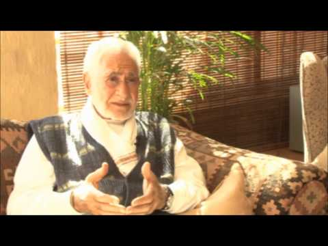
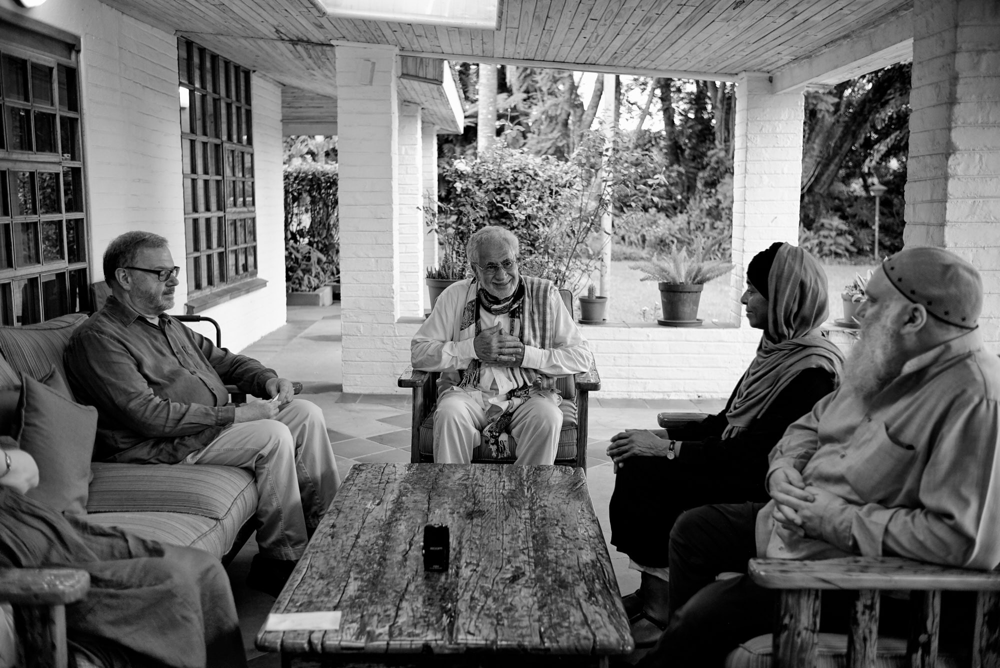

title: Supplication

description: A brief description, with examples, of the practice of supplication and its benefits for any seeker.

# The Practice of Supplication

**Supplication & Human Transformation**

[Watch](https://www.youtube.com/watch?v=RnSE_C3Z-9g)

## A Prophetic Supplication to Remove Darkness and Impurity and Attract Light

The mirror of the heart of the seeker becomes clearer and the signs of the Realm of Divine Power and the lights of the Spiritual Regions become manifest there. It is for this reason that the Prophet (pbuh) used to beseech the following in his whispered supplications:

> “O Allah, make a light in my heart, a light in my hearing, a light in my vision, a light in my flesh, a light in my blood, a light in my bones, a light before me, a light after me, a light on my right, a light on my left, a light above me, and a light below me, a light in my heart. O Allah, increase me in light and make me a light (I beseech You) by what is Your due, O most Merciful of the Merciful.”

This supplication removes darkness and impurity and attracts light, purity and virtue. If it is accepted one joins the People of the Spiritual Regions and the Realm of Divine Power, with the appropriate potential.

## Withdrawal And Drawing Near  

> “My servant does not draw near to Me with anything more beloved than by way of the obligations which I have ordained for him. He may draw near to me with additional actions (nawafil) if I love him. If I love him I become his hearing by which he hears and the sight by which he sees. I become the tongue by which he speaks and his hand with which he grasps. If he asks me in prayer I will answer him, and if he beseeches Me I will grant it to him.”        

The language of distance is metaphorical, for Allah is not subject to place or time, for He pervades the universe and beyond – Allahu Akbar. If the decree of tawhid or unity prevails, being far or being near is merely a function of an individual's perceptual framework, the state of which is itself modulated by the degree of higher consciousness. Since, however, our experience of life is moderated by patterns of duality along a spectrum of extremes, the idea of being close or far can be helpful in distinguishing levels of awareness.  

Drawing ‘near’ is always preceded by withdrawal from all else. Pre-eminent among the things which one turns to other than Allah is the self itself and its various spheres of influence, which are:

1. The sphere of senses, that is, the connection with the material realm of nature.
2. The sphere of emotions and the realms of allegory and symbolism.  
3. The sphere of reason and intellect’s true essence; this realm is void of matter and form.

The serious worshipper, in his prostration, passes by these three spheres as he withdraws from the world and enters into a sacred state beyond the mind.  

> “And remember the name of your Lord and devote yourself to Him completely” – Qur'an, 73:8  

## Integration

Being with people, serving them, and putting up with their difficulties is balanced by the act of withdrawal, seclusion, and reflection. Prophet Muhammad (pbuh) regularly spent time in the cave called Hira outside Makkah for several days at a time. It was at the culmination of such periods that revelation occurred. The Qur’an describes the 40 days Moses spent in seeking his Lord, before he was given the ‘tablets’. The tradition of 40 days of seclusion (_khalwah_ or _chillah_, from _chehel_, forty in Persian) was taken by Sufi Masters to be a rite of passage, a serious emptying out (_khalwah_ derives from _khaliya_, to empty out): 

> "And when you are free [of worldly concerns] … then turn your desire to your Lord" – Qur'an 94:7-8.  

Smaller periods of time are also practiced regularly. The smallest period is ultimately symbolized by the salat which punctuates the day five times, giving us the chance to reconnect in awareness with the underlying reality that grounds our existence.

Further information on the dynamics of transformative worship and the unique applications of the Essential Islamic model can be found in the publication [Transformative Worship in Islam - Experiencing Perfection](../../../books/general-islam/transformative-worship).

