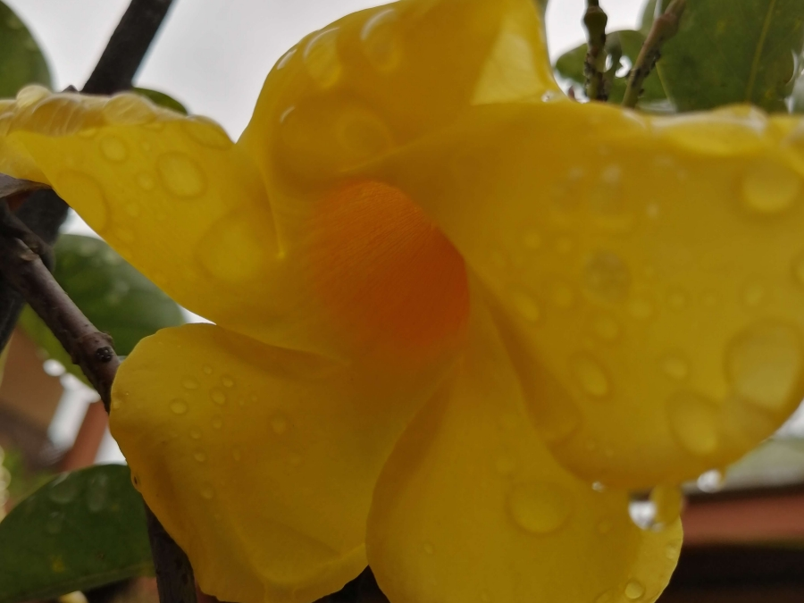

# Journey 10 - Differentiated Sameness

In truth, whatever you do to others, you do to yourself.  

In our outer appearance we all seem different, yet in our quest and desire we are the same. Reality or God is the sublime, incomparable Light of lights. That uniqueness is reflected in our own soul.  

Unless you connect on higher consciousness, then conditioned consciousness highlights differences rather than sameness and harmony.  

The paradox is that the human soul is both exclusive (you have it) and inclusive (everyone lives by it).  

A politician strives to reduce inequality whereas a sage knows everyone is inwardly equal and outwardly different.  

Longing to belong; we all strive to belong to the greatest and most desirable: our soul is that.  

A human being is a product of the past and the present. The future is a continuation of that stream of consciousness modified by will and interactions. 

