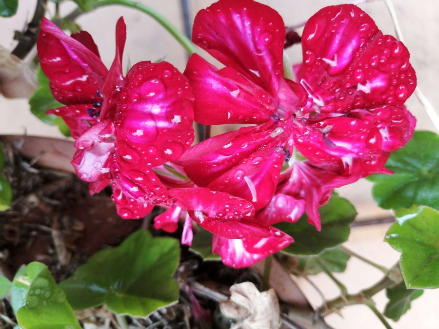

# Happiness and Content 

We strive for happiness through plans, efforts and desires - all of which preclude and exclude it.  

No one is really happy with where they are. Happiness cannot be bound to a situation for it is the child of total freedom.  

You are either in happiness and thus oblivious to everything else, or you remember and relate to that state.  

Leisure and pleasure may often lead to degrading consciousness, unless there is conscious effort to transcend mind and the senses.

Happiness implies mindfulness and loss of sense of time and place.  

Happiness is a state of sheer being and not becoming. It doesn’t relate to past or future - it is totally in the **now**.

 