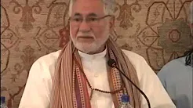

# 2012 Academy of Self Knowledge

## Sacred Expressions in the Qur'an

**Sacred Expressions - Part 1**

[Watch](https://www.youtube.com/watch?v=Onceeti9Dio)

**Sacred Expressions - Part 2**

[Watch](https://www.youtube.com/watch?v=-2jzm2RCftM)

## 2012 Closing Remarks 

**2012 Closing Remarks**

[Watch](https://www.youtube.com/watch?v=r1DpQUE2CSM)

