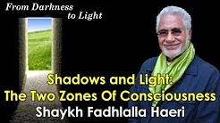
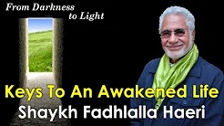

# From Darkness to Light

## Resolving the Paradox 

Light and other forms of energy and matter are caught within the confines of time and space. The mystery of life and creation can be traced at the boundaries of space and time and in the original and ever-present sacred void. The human tendency of wanting to stretch a good time eternally or to stop a ‘bad’ time instantly echoes the quest to break out of space-time limitations. It is natural for conditioned consciousness to lead to what is past worldly limitations to the zone of transcendental pure consciousness. The healthy seeker connects all aspects of relative sensation to the timeless state of inner perception, the soul’s insight or Divine light.

> “He grants wisdom to whom He pleases, and whoever is granted wisdom, he indeed is given abundant goodness …..” (2:269)

Another paradox in human experience is that of the old and the new. The timeless and that which is within time are never separate since the absolute and the relative always resonate together. We seek the most old and ancient, as well as that which is ‘now’, fresh and new. Both of these time-related ideas disappear when we catch a glimpse of the eternally perfect instant. This is why it is said that there is no merit in abstentions, unless they lead to spiritual awakening. The death of the ego is the birth of the enlightened self – a new life.

_From the book “[Happiness in Life and After Death](https://zahrapublications.pub/book-HappinessInLifeAndAfterDeath.php#bookTitle)”_

## Where and When Truth Exists

Truth is before all  
anything and after all   
anything is gone.

The universe is held by Truth. Truth is the cause of all experiences and realities. Consciousness and life are energised by the grace of Truth.  

The supreme mystery of life is to know and resolve this puzzling situation. If all is by the grace of Truth, then what is my personal relationship with it? Am I totally dependent? If I am dependent, how is it that I have a will? I have needs, desires and attractions and repulsions!        

How can I access this unimaginable Presence?! Surely, I must start by questioning the identity of the questioner! Who am I? What is human nature? If there are two zones – the human and Divine, then how do I access the Divine? Do I lose my humanity to experience the spiritual Reality? After all there is only Truth. How to transcend falsehood that apparently veils its light.
Truth is not subject to the limitations of space and time, it encompasses the universe. It is true that I have the same will and power. It is also true that I will lose them. Divine will and power is constant and permanent and to realise this is being at one with Truth.    

## Talks

**Shadows and Light: Two Zones of Consciousness**

[Watch](https://www.youtube.com/watch?v=UWhUAPhKkDg)

**Keys to An Awakened Life**

[Watch](https://www.youtube.com/watch?v=IByqUR_m-Ig)

