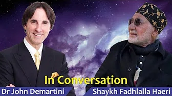

# Specific Conversations

Connection and continuation are dominant in human consciousness —at all stages of life and existence.

**Part 1**

<a target="_blank" href="https://www.youtube.com/watch?v=jM0ffK8wLIc">Watch</a>

**Part 2**

<a target="_blank" href="https://www.youtube.com/watch?v=od7qZ7aUsVo">Watch</a>

## Dr John Demartini

**In Conversation with Dr John Demartini**

<a target="_blank" href="https://www.youtube.com/watch?v=-66_0MuykH4">Watch</a>

