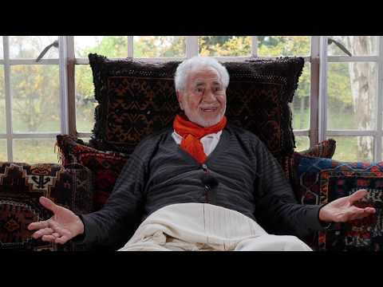
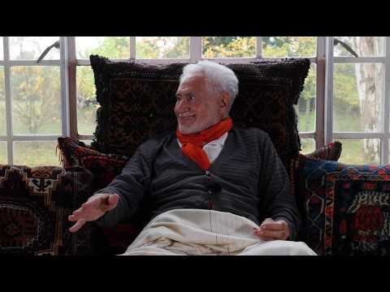
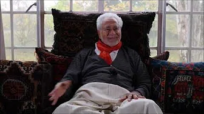

title: Highwood Talks

description:

# Highwood Talks

Shaykh Fadhlalla's personal residence is farm called Highwood in South Africa. This amazing and tranquil place has played host to many wonderful talks, gatherings and encounters over the years and on this page, you can find all of those that have been recorded, starting with the most recent.

In order to introduce this section properly, we recommend you reflect upon one of the Shaykh's poems in order to get some appreciation for the ambience surrounding many of these videos:

## Morning in the Plantation

_By Shaykh Fadhlalla Haeri, from the book "The Four Journeys"_.

Parchment-like, thin as a muslin veil,  
The radiant green banana fronds glistened  
and waved farewell to the morning mist.  

Like victory flags parading on the hilltop,  
blending the orchard songs of buds, trees and palm fronds,  
merging with colours, forms and stillness  
unified in the early light  
in delight, in symphony, in harmony cloaked in white,  
from light unto light  
all defined by changing shadows confined to hills and meadows without   
which there can be no vision nor desperation for divine admission.  
  
And awakening into colourless stillness into the presence of  
Light-beyond-light the boundless Essence  
behind and in front and within all sights — _Allah-Hu_.

## Daytime Questions with Shaykh Muslim

**Light of Lights**

[Watch](https://www.youtube.com/watch?v=kfN_DObkSM4&list=PLzFr0xRIkb3gVfjRtai2-XBlvWVprgHqP&index=40&t=0s)

**Free Will or Predetermination?**

[Watch](https://www.youtube.com/watch?v=yvbzO4dDgD0&list=PLzFr0xRIkb3gVfjRtai2-XBlvWVprgHqP&index=39&t=0s)

**Forgiveness and What Happens After Death**

[Watch](https://www.youtube.com/watch?v=ckcXZs7mejE)

**What is The Day of Judgement?**

[Watch](https://www.youtube.com/watch?v=LyGrhZOjSXE&list=PLzFr0xRIkb3gVfjRtai2-XBlvWVprgHqP&index=38&t=0s)

**Is There Reincarnation in Islam?**

[Watch](https://www.youtube.com/watch?v=xQA91yHPDpM&list=PLzFr0xRIkb3gVfjRtai2-XBlvWVprgHqP&index=37&t=0s)

**Islam and Science**

[Watch](https://www.youtube.com/watch?v=nA2wKknIjQQ&list=PLzFr0xRIkb3gVfjRtai2-XBlvWVprgHqP&index=36&t=0s)

**Why is the Number 7 Considered Sacred?**

[Watch](https://www.youtube.com/watch?v=VSr2IUp-2w8&list=PLzFr0xRIkb3gVfjRtai2-XBlvWVprgHqP&index=35&t=0s)

**Why Is There So Much War Between Religions?**

[Watch](https://www.youtube.com/watch?v=F81bv5vTEZs&list=PLzFr0xRIkb3gVfjRtai2-XBlvWVprgHqP&index=34&t=0s)

**Is The Idea of an Islamic State a Myth?**

[Watch](https://www.youtube.com/watch?v=_XbfRNlmT5E&list=PLzFr0xRIkb3gVfjRtai2-XBlvWVprgHqP&index=33&t=0s)

**Will Islam Become Private Like Christianity?**

[Watch](https://www.youtube.com/watch?v=MFQk2srM9LU&list=PLzFr0xRIkb3gVfjRtai2-XBlvWVprgHqP&index=32&t=0s)

**Is God Male or Female?**

[Watch](https://www.youtube.com/watch?v=gHBhA6kqRCQ&list=PLzFr0xRIkb3gVfjRtai2-XBlvWVprgHqP&index=31&t=0s)

**Why Are There No Female Prophets?**

[Watch](https://www.youtube.com/watch?v=gveAbNn7x2U&list=PLzFr0xRIkb3gVfjRtai2-XBlvWVprgHqP&index=30&t=0s)

**Where is God?**

[Watch](https://www.youtube.com/watch?v=flT29MVm1VY&list=PLzFr0xRIkb3gVfjRtai2-XBlvWVprgHqP&index=29&t=0s)

## Fireside Talk

**Bismillah**

[Watch](https://www.youtube.com/watch?v=7IVw4bnF0K0&list=PLzFr0xRIkb3gVfjRtai2-XBlvWVprgHqP&index=28&t=0s)

**The Constant Behind the Changing**

[Watch](https://www.youtube.com/watch?v=BYTdRdd-MoI&list=PLzFr0xRIkb3gVfjRtai2-XBlvWVprgHqP&index=27&t=0s)

**Why Do We Love Free Gifts?**

[Watch](https://www.youtube.com/watch?v=WOWsnq0sbxM&list=PLzFr0xRIkb3gVfjRtai2-XBlvWVprgHqP&index=26&t=0s)

**From Limitations to the Limitless**

[Watch](https://www.youtube.com/watch?v=ZJoNO75NKX8&list=PLzFr0xRIkb3gVfjRtai2-XBlvWVprgHqP&index=25&t=0s)

**Good Deeds**

[Watch](https://www.youtube.com/watch?v=bgQrxkJjpXc&list=PLzFr0xRIkb3gVfjRtai2-XBlvWVprgHqP&index=24&t=0s)

**Patience**

[Watch](https://www.youtube.com/watch?v=XbGToVGF4hg&list=PLzFr0xRIkb3gVfjRtai2-XBlvWVprgHqP&index=23&t=0s)

