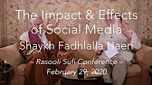

title: SFH in Conversation with Shaykh Muslim

description: A series of conversations over the years between Shaykh Fadhlalla Haeri and Shaykh Muslim

# SFH in Conversation with Shaykh Muslim

Mohammad Åke Daniel Muslim Eneborg became a Muslim in 1980 and has had a close relationship with Shaykh Fadhlalla for many years. He spent the 80's traveling around the Muslim world, mainly in South Asia and North Africa, but also in more or less Muslim areas in Europe. During this trip, he gained insight into various Muslim cultures and how these communities relate to Islam, their national culture and traditions. He then settled in the UK, married and subsequently had four children. Meanwhile, he studied Arabic and Urdu.

He has also studied Islamic theology at several other Islamic institutes and is known in Muslim circles as an _alim_, or scholar in the Muslim sciences. He has worked as an imam at a number of mosques in the UK where he was also responsible for, among other things, an imam education for women and teaching about Islam at universities and other institutions in Europe.

Mohammad did not grow up in a religious home, but ever since he became a Muslim he has been deeply interested in and engaged in interreligious dialogue and conversations about the role of religion in postmodern society. He frequently participates in dialogues with Christian and Jewish representatives in Sweden and the United Kingdom, and often visits schools and churches as an invited guest lecturer. He is not often asked by the media to comment on Islam and Muslims in Europe.

Today, he works as an imam in a mosque on Fridays, and is responsible for operations at Inleva AB, as well as responsible for the operations on [Det yttersta trädet](https://translate.google.com/translate?hl=en&sl=sv&u=https://dyt.se/).

He has had many conversations over the years with Shaykh Fadhlalla and you can find them all listed below, starting with the most recent at the Rasooli Centre in Pretoria, South Africa in March 2020.

## Rassoli Centre 2020

**The Origin of Good and Bad**

[Watch](https://www.youtube.com/watch?v=HkYFYz6cPds&list=PLzFr0xRIkb3gZ8fH7Ru4Z0aCngiEgt4JJ&index=17)

**The Way of Muhammad Today**

[Watch](https://www.youtube.com/watch?v=DMJWvJIsmL8&list=PLzFr0xRIkb3gZ8fH7Ru4Z0aCngiEgt4JJ&index=16)

**The Role of Men & Women**

[Watch](https://www.youtube.com/watch?v=5dWxeKQdbZ0&list=PLzFr0xRIkb3gZ8fH7Ru4Z0aCngiEgt4JJ&index=15)

**The Impact of Social Media**

[Watch](https://www.youtube.com/watch?v=rIrEe-qU-zI&list=PLzFr0xRIkb3gZ8fH7Ru4Z0aCngiEgt4JJ&index=14)

**The Failure of Political Leadership**

[Watch](https://www.youtube.com/watch?v=JskioL2nauM&list=PLzFr0xRIkb3gZ8fH7Ru4Z0aCngiEgt4JJ&index=13)

**Economism as the New Religion**

[Watch](https://www.youtube.com/watch?v=pH6T2sG-6JY&list=PLzFr0xRIkb3gZ8fH7Ru4Z0aCngiEgt4JJ&index=12)

**Are You Ready to Face the Absolute?**

[Watch](https://www.youtube.com/watch?v=YrDrrh5Ol5Q&list=PLzFr0xRIkb3gZ8fH7Ru4Z0aCngiEgt4JJ&index=11)

## Highwood 2019 - Surat al-Hadid Tafsir

**Islam, Iman, Ihsan**

[Watch](https://www.youtube.com/watch?v=R503LTlwdV0&list=PLzFr0xRIkb3gVfjRtai2-XBlvWVprgHqP&index=20&t=0s)

**Whatever is in Heavens and Earth Glorifies God**

[Watch](https://www.youtube.com/watch?v=gmos6DEFrW0&list=PLzFr0xRIkb3gVfjRtai2-XBlvWVprgHqP&index=19&t=0s)

**His is the Dominion of the Heavens and Earth**

[Watch](https://www.youtube.com/watch?v=Wvx3XWomZ2U&list=PLzFr0xRIkb3gVfjRtai2-XBlvWVprgHqP&index=18&t=0s)

**He is the First and the Last, the Outer and the Inner**

[Watch](https://www.youtube.com/watch?v=qXAewLnAPw8&list=PLzFr0xRIkb3gVfjRtai2-XBlvWVprgHqP&index=17&t=0s)

**God Is With You, Wherever You Are**

[Watch](https://www.youtube.com/watch?v=3ty2v_NQ6ao&list=PLzFr0xRIkb3gVfjRtai2-XBlvWVprgHqP&index=16&t=0s)

**And to God All Matters Are Returned**

[Watch](https://www.youtube.com/watch?v=F6kfd4AMv40&list=PLzFr0xRIkb3gVfjRtai2-XBlvWVprgHqP&index=15&t=0s)

**He Cause The Night To Enter The Day**

[Watch](https://www.youtube.com/watch?v=6uA4QZ8Owek&list=PLzFr0xRIkb3gVfjRtai2-XBlvWVprgHqP&index=14&t=0s)

## Highwood 2019 - Sixth Sense & Angels

**What is the Sixth Sense?**

[Watch](https://www.youtube.com/watch?v=v7A_1rjtP6g&list=PLzFr0xRIkb3gVfjRtai2-XBlvWVprgHqP&index=22&t=0s)

**What Are Angels?**

[Watch](https://www.youtube.com/watch?v=fnQNLDd4ejE&list=PLzFr0xRIkb3gVfjRtai2-XBlvWVprgHqP&index=21&t=0s)

