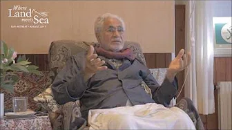
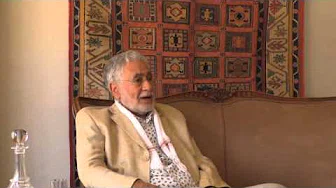

title: Introduction

description: A collection of talks given by Shaykh Haeri considered by his students to be a good introduction to, and basic overview of, his more general work.

# Getting to Know Shaykh Fadhlalla

## Overarching Ideas

These four videos are exemplary of some of the Shaykh's overarching ideas. While it is not possible to summarise his massive body of work into four simple videos, each one of these illustrates a key tenet of his teaching. Learning how to conduct one's self properly; how to be correct and courteous in all of one's outer actions naturally leads on to begin questioning some of the inner meanings so-called correct conduct is based upon. Questioning these is not actually a matter of faith, but of a certain kind of knowing that grows from seeing yourself, your thoughts, and your actions within the wider framework of what the Shaykh often calls "The Three C's" - connection, continuity and consciousness. This most useful and broad map, when applied with awareness and understanding, can lead one to experience this idea of differentiated sameness: seeing everywhere the multiple faces of One God.

**Self Conduct**

[Watch](https://youtu.be/_n9bjtTLbFQ)

**How Can You Keep Faith In Times of Fear?**

[Watch](https://www.youtube.com/watch?v=Dm9nNnuaIhw)

**Connection, Continuity, Consciousness**

[Watch](https://www.youtube.com/watch?v=XOBffhHNlpc)

**Differentiated Sameness**

[Watch](https://www.youtube.com/watch?v=y4HG4jDJYlU)

## The Spiritual Path

**Part 1**

[Watch](https://www.youtube.com/watch?v=v_7sGq8fyYg)

**Part 2**

[Watch](https://www.youtube.com/watch?v=yawfdD_0jG4)

**Part 3**

[Watch](https://www.youtube.com/watch?v=WRCbiNyAmF4)

**Part 4**

[Watch](https://www.youtube.com/watch?v=v_7sGq8fyYg)

**Part 5**

[Watch](https://www.youtube.com/watch?v=nqS8IGt44-0)

**The Importance of Choosing a Path**

[Watch](https://www.youtube.com/watch?v=vo4hC7mO15k)

**What is Presence?**

[Watch](https://www.youtube.com/watch?v=_NZmxaAHFZk)

**Live Fully Knowing You Will Die**

[Watch](https://www.youtube.com/watch?v=Prw7zP064LY)

## Personality, Purpose, Modernity, and Meaning

**Personality**

[Watch](https://www.youtube.com/watch?v=4Ou8ji29XSg)

**The Purpose of Religion**

[Watch](https://www.youtube.com/watch?v=L9kWeKg5ULo)

**Islam and Science**

[Watch](https://www.youtube.com/watch?v=QnJCslNl4Lo)

**What is the Meaning of Life?**

[Watch](https://www.youtube.com/watch?v=pvOkp3hvmbQ)

