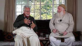
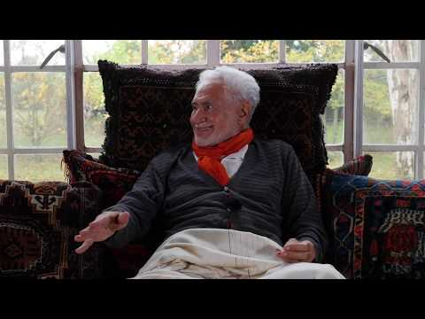

title: Purifying

description: A collection of talks given by Shaykh Haeri considered by his students to be a good introduction to, and basic overview of, his more general work.

# Purifying

## Overarching Ideas

These four videos are a broad stroke presentation of Shaykh Fadhlalla’s work. Regard these excerpts as introductory illustrations of key tenets of the essentail teaching. The three basic pillars of **Islam** are (surrender, submission, acceptance), **Iman** (trust, faith) and **Ihsan** (contentment, excellence). Harmonious and wholesome interactions and behaviour with the phenomenal world is seamlessly connected to divinity.  

Being correct and courteous in all of one's outer actions naturally leads one to begin questioning the meanings behind the dynamics of activity. This inquiry is born and fostered through faith; awareness; trust in the oneness of reality; and an evolving, unfolding knowing that grows from seeing and examining yourself, your thoughts, and your actions within the wider framework of three of life's major forces - connection, continuity and consciousness. This most useful and broad map, when applied with awareness and understanding, can assist one in progressively witnessing the perfection of the moment, and resonating with the immensity of the unchanging now.

**Islam, Iman, Ihsan**

[Watch](https://www.youtube.com/watch?v=R503LTlwdV0&list=PLzFr0xRIkb3gVfjRtai2-XBlvWVprgHqP&index=20&t=0s)

**Self Conduct**

[Watch](https://youtu.be/_n9bjtTLbFQ)

**Connection, Continuity, Consciousness**

[Watch](https://www.youtube.com/watch?v=XOBffhHNlpc)

**Differentiated Sameness**

[Watch](https://www.youtube.com/watch?v=y4HG4jDJYlU)

## The Spiritual Path

We often search for what is labelled as Truth, God, Reality or The One. People who adhere to specific religions or paths consider theirs to be superior to others, even though there may be as many ways to God as there are human beings. The illusion of separation is the cause of all ignorance. The quest and need for a path arises due to the illusory experience of a separate identity and personal point of view.  

Many search for a path to the Divine, though few seem to find one which is durable, sustainable and can serve as a container capable of bearing them along the entire distance they must travel (while revealing that distance to be just another illusion!).  

A tried and tested truth, though, is that more the _[nafs](../../glossary/key-words)_ is restricted, the narrower the path becomes and the  brighter the light of the soul. Everyone is on a path, whether consciously or unconsciously. The important thing is to have a trustworthy reference. On a jagged path, that reference will bring you back to easy passage. Then you are more efficient in realizing presence, uniting the visible and invisible, and returning to One.    

**Part 1**

[Watch](https://www.youtube.com/watch?v=v_7sGq8fyYg)

**Part 2**

[Watch](https://www.youtube.com/watch?v=yawfdD_0jG4)

**Part 3**

[Watch](https://www.youtube.com/watch?v=WRCbiNyAmF4)

**Part 4**

[Watch](https://www.youtube.com/watch?v=v_7sGq8fyYg)

**Part 5**

[Watch](https://www.youtube.com/watch?v=nqS8IGt44-0)

**The Importance of Choosing a Path**

[Watch](https://www.youtube.com/watch?v=vo4hC7mO15k)

**What is Presence?**

[Watch](https://www.youtube.com/watch?v=_NZmxaAHFZk)

**Live Fully Knowing You Will Die**

[Watch](https://www.youtube.com/watch?v=Prw7zP064LY)

## What Can You Control?

Will, desire and ability are key forces in our life and quest for connectedness and continuity. We live according to what is within our domain to change or control. A child expresses anger and disappointment due to failure or the inability to achieve what they desire. God’s agent within us, our Soul, controls our life and its shadow image, self or ego. Yet the self falls into the illusion of control and ownership – this is my dog, my house or my cousin. When did these controls come about and for how long? The dog is a living entity with its own nature. We can only exercise some control with limited certainty.  

As long as anything moves, its destiny and existence are uncertain. Nature provided a suitable environment for life and consciousness to emerge within the confines of the womb of space and time - that is the history of life on earth. However that limited cosnciousness is charged by permanent consciousness, by **sacred beingness**. From this emerges a short-lived human life dependent always on eternal life. All is under Soul-control, but we are veiled by the ability to move and change. You can close the door or leave it open. You can leave this place or not. Speak or be silent. Limited, limited, limited. We are given a tiny opening to visualize the infinite, self-propelled universe, which is under perfect governance at all times. Human life is like a waiting room before we perceive the reality of perfect control, by One who permeates it all.    

**Personality**

[Watch](https://www.youtube.com/watch?v=4Ou8ji29XSg)

**Parenthood**

[Watch](https://www.youtube.com/watch?v=RXG30_xI0k8)

**Islam and Science**

[Watch](https://www.youtube.com/watch?v=QnJCslNl4Lo)

**What is the Meaning of Life?**

[Watch](https://www.youtube.com/watch?v=7zvlBBK4vPA&list=PLzFr0xRIkb3gVfjRtai2-XBlvWVprgHqP&index=48)

**Who Am I?**

[Watch](https://www.youtube.com/watch?v=Z5Ptnhr96v4&list=PLzFr0xRIkb3gVfjRtai2-XBlvWVprgHqP&index=55&t=0s)

**God Is With You, Wherever You Are**

[Watch](https://www.youtube.com/watch?v=3ty2v_NQ6ao&list=PLzFr0xRIkb3gVfjRtai2-XBlvWVprgHqP&index=16&t=0s)

## Insight, The Soul and Calibration

We often experience disappointment and frustrations. We also too often feel trapped, confused or lost. Why are we constantly faced with these challenges? This is due to the limitations of conditioned consciousness and ego. Between birth and death, we play roles in this shadow theatre of life, as we evolve towards our origin.  

Frustrations arise out of the disparity between our higher Soul consciousness and the shadow self. How can we refer and calibrate our perceived experience with the constancy of the soul? It is helpful to have a role model, and more helpful to have a trusted teacher who reflects higher consciousness.            

The zone of higher consciousness is infinite and beyond all descriptions like joy, bliss or happiness. A good example of how to move to higher consciousness is riding a bicycle. You are put on the saddle and somebody pushes you. After a while you learn to balance and you feel you can repeat it on your own. Similarly, you first need a map of Reality, and you then follow the path that may lead to your destination.  

Determination and grace are required to awaken to your Soul. It is when you experience that ever-present Reality, you know that your old self was merely a shadow, of the Real. When you transcend your tyrannical or feral self, you perceive that its role was to cause that suffering and thereby act as a prelude for awakening. Your lower self leads you to your real self – the divine spirit within. Life on earth is a struggle because it is a realm of experience between limitations and limitless Reality. You need help and a guiding hand. You need a reference. You need Grace and perception of the sacred presence.    

**You Are Not the Past**

[Watch](https://www.youtube.com/watch?v=QGHJW1iJg20)

**Insight**

[Watch](https://www.youtube.com/watch?v=8roXpi3irZg)

**Self-Soul Dynamics**

[Watch](https://www.youtube.com/watch?v=s_XBbGUvpSw)

**Calibration**

[Watch](https://www.youtube.com/watch?v=jxNNs3haWW4)

**The Soul: The Meaning Behind the Form**

[Watch](https://www.youtube.com/watch?v=WVsIR_eQ39c&list=PLzFr0xRIkb3gVfjRtai2-XBlvWVprgHqP&index=51&t=0s)

**Space, Time & Generosity**

[Watch](https://www.youtube.com/watch?v=UwJyC0szP_I&t=2s)

**Different Levels of Enlightenment**

[Watch](https://www.youtube.com/watch?v=5LUUgM1UFOU)

**Forgiveness and What Happens After Death**

[Watch](https://www.youtube.com/watch?v=ckcXZs7mejE)

## Where Land Meets Sea - A Selection

Where Lands Meets Sea is a YouTube channel curated by friends of the Shaykh Fadhlalla Haeri Foundation based in Sweden. We encourage you to watch as many of the videos as you can make time for in this fantastic selection. Below, we list some choice clips we have been enjoying:

**Personality, Consciousness, 6th Extinction**

[Watch](https://www.youtube.com/watch?v=Be9oJjKUQ2k&list=PLzFr0xRIkb3gVfjRtai2-XBlvWVprgHqP&index=1)

**Differentiated Sameness - Full**

[Watch](https://www.youtube.com/watch?v=N6PemRIhThg&list=PLzFr0xRIkb3gVfjRtai2-XBlvWVprgHqP&index=12&t=0s)

**From Limitations to the Limitless**

[Watch](https://www.youtube.com/watch?v=ZJoNO75NKX8&list=PLzFr0xRIkb3gVfjRtai2-XBlvWVprgHqP&index=25&t=0s)

**Surat al-Hadid Tafsir**

[Watch](https://www.youtube.com/watch?v=TJDKN6p_SAA&list=PLzFr0xRIkb3gVfjRtai2-XBlvWVprgHqP&index=45&t=0s)

**Free Will or Predetermination?**

[Watch](https://www.youtube.com/watch?v=yvbzO4dDgD0&list=PLzFr0xRIkb3gVfjRtai2-XBlvWVprgHqP&index=39&t=0s)

**The Arc of Consciousness**

[Watch](https://www.youtube.com/watch?v=WiulqZyIAPU&list=PLzFr0xRIkb3gVfjRtai2-XBlvWVprgHqP&index=43&t=0s)

**The Soul's Timeless Reality**

[Watch](https://www.youtube.com/watch?v=A1U9abHA9Gg&list=PLzFr0xRIkb3gVfjRtai2-XBlvWVprgHqP&index=63&t=0s)

