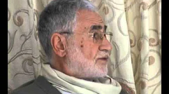
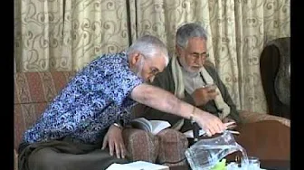

title: Surat al-Balad Tafsir

description: A collection of recordings showing Shaykh Fadhlalla and Shaykh Muslim in conversation about the 57th Surat of the Qur'an, al-Balad.

# Surat al-Balad Tafsir

On this page, you will find a collection of shorter clips cut from a talk given by Shaykh Haeri on Chapter 90 of the Qur'an, known properly as Surat Al-Balad (The City). Before listenting to these older video clips, we strongly suggest you acquaint yourself fully with the Shaykh's more universalist and accessible teachings, and only return here if you truly are seeking deeper knowledge of the Qur'an and its interwoven unveilings. The best place to start this process is the audio clip of a talk given onso-called enlightenment, which you can find [here](../../../audios/single-talks/#enlightenment).

We must begin with the fact that there is indeed a map of Creation which can be used to live a life of equanimity. This map is not there to be discussed endlessly, but to be travelled along. Moreover, it is not only about walking along the road, but actually arriving at The City. Without denying relative existence, you must come to understand your authentic self through honesty, good conduct, trust, love, and faith. Stemming from it’s Greek roots, ‘authenticity’ can variously be imagined as the Soul, the higher self, or God’s light within you. Once you grasp that such a sacred reference point exists within you, then talk of the map is no longer necessary. In fact, the map is no longer necessary, because it becomes just another kind of false security. The key question remains, “Are you in The City?” And then, “Have you discovered that there is actually neither you nor City?” The entire Light, which is beyond both known and unknown, is in you already. That is truly awesome. That is why one has to move with good conduct, with authenticity and genuine honesty, according to who you are. Here is the basis of arrival.

## Videos

**Clip 1**

[Watch](https://www.youtube.com/watch?v=pet9fsZ6cw0)

**Clip 2**

[Watch](https://www.youtube.com/watch?v=v5moB2MWA-w)

**Clip 3**

[Watch](https://www.youtube.com/watch?v=voltvrJW3iU)

**Clip 4**

[Watch](https://www.youtube.com/watch?v=LeAhvySu81Q)

**Clip 5**

[Watch](https://www.youtube.com/watch?v=hqFBClq8kFQ)

