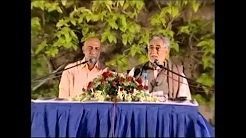
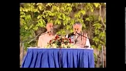
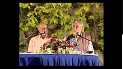
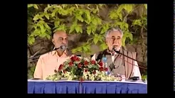

# Prescriptions for Living from the Holy Qur'an

Below, you will find four older talks (recorded on 18th March 2005) in which Shaykh Fadhlalla describes some of the Qur'anic prescriptions for living by commenting on a selection of _ayat_ or specific lines from different Surats in the Holy Qur'an.

In order to introduce this section properly, please reflect on these three excerpts from Shaykh Fadhlalla's more recent book, "[Witnessing Perfection](../../../books/sufism/witnessing-perfection)":

## Information and Transformation

> "Human growth and evolvement is enhanced as we respond to facts and information by reference to rationality as well as higher consciousness."

Personal consciousness evolves when the senses, mind and body interact with the outer world and ‘make sense’ out of events and situations. The mind develops by investigating cause and effect, and the connection between new experiences and events with past memory and knowledge. The self needs to exchange news and information, transmit and receive feelings and evaluations, in order to evolve further in consciousness. The human urge to push the boundaries of possibilities further into the unknown is constant. The ‘sky is the limit’ is a natural human tendency, for we are both earthly (limited in personal consciousness) and heavenly (boundless pure consciousness). Thus, the sky is not the limit; it is the prelude to higher and endless ‘skies’.  

Today’s vast quantities of available information present a challenge and opportunity as to how best to utilise this wealth of data and information for the sake of inner transformation. Transformation implies transcending self images, the rational mind and the discernable world towards pure consciousness, beyond all specific, tangible realities and experience. This drive motivates the search for perfection in all worldly situations but it is frustrating at the same time, for our natural world is subject to change and unpredictability. Thus we seek perfection always (where the state of the soul is) and can never attain it for any duration.
Personal suffering is the result of distractions in the self’s hesitant progress towards inner realization, fulfilment and contentment. The self always desires states and experiences that are not realistic or sustainable in the changing world of space-time. Every self innately aspires for the qualities of the soul and thus can only be content after submitting to the soul’s boundless light and higher consciousness. Freedom, as such, is a by-product of unity between the head and heart, self and soul. The soul is ever free and the self is ever restless in its search.

> "It is a wise one who is always hopeful to learn meanings and lessons from difficulties and hardships."

## If We Are Willing To Stop

Human beings reflect the cosmic perfection at the point of conception but, as we grow errors and defects become prominent with increased entropy. Our apparent freedom of action only increases our imperfections. ‘And time must have an end’ is the ultimate and just remedy for all earthly endeavours. If we are willing to stop, our chances of an appropriate start are greater. When the stop/start frequency resonates within head and heart, the ‘self and soul connection’ is stronger. Unity in consciousness is the fruit of spiritual evolvement which encompasses the seen and unseen worlds.

## There is None Except One

The disciple declared that there are countless beings in existence, but the master insisted that there is none except One. He then reminded the student that when you truly open your eyes many may appear within your sight, whereas in truth these are only shadows of the everlasting one light within them, before them and after them. The master then sang:

> "Passion for God has bewildered me; thus I am alien and a stranger in this world. When I appear He (God) vanishes, and when He appears I vanish."

## Tafsir

**Part 1**

[Watch](https://www.youtube.com/watch?v=6YiHzwgrLvM)

**Part 2**

[Watch](https://www.youtube.com/watch?v=Md1P5ZUKKWQ)

**Part 3**

[Watch](https://www.youtube.com/watch?v=hF7WpxKovrA)

**Part 4**

[Watch](https://www.youtube.com/watch?v=j9OkKz8Ew90)

