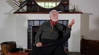

title: The Qur'an and Happiness

description: A collection of talks given by Shaykh Fadhlalla Haeri on the theme of The Qur'an and Happiness

# The Qur'an and Happiness

These three talks stand alone in terms of the clarity and insight they provide into the Qur'anic notion of happiness, and how it applies specifically and practically in our own lives. In order to introduce this work properly, please read over the following excerpt from Shaykh Fadhlalla's book ["The Sufi Way of Self Enfoldment"](../../../books/sufism/sufi-self-enfoldment) first:

We all want happiness and we define happiness as desires achieved. When all desires are achieved, we say, ‘I am tranquil.’ Well, why can’t we be tranquil to begin with? Who made me have all these multitudinous desires? There are basic needs, but we don’t suffer from the lack of those basic things now, things such as shelter, clothes, food. It is ingrained in us, in our chromosomes, to keep the body alive as well as we can, in order to discover the purpose of it all – that is the purpose of living.    

Man is the seeker of his cause. The closer he gets to it, the more he realizes that the basis of happiness is self-fulfilment. It is I who decided that unless these desires are satisfied I am not fulfilled: a job, a good position, a good salary, a house. A man on the island off Malaysia has not got the same desires, he has others. Yet it is the same process. It is the individual who decides. And when on occasions he is fulfilled, he is at a point of tranquility. We all want tranquility. We all want peace. But if we do not have peace from within ourselves, we cannot have peace outside.

Nothing and no one brings us happiness, it is the removal of unhappiness that takes place. I am poor. Now I inherit a fortune, and what happens? Poverty is removed. Money did not bring me happiness, it removed unhappiness. My unhappiness is different from anyone else’s. If I do not want belongings, then I suffer from having an excess of belongings, which is another way, more subtle and more difficult. ‘I don’t want anything. I’m going up to the mountain and I’m leaving all this behind!’ But you cannot run away from the world. You cannot run away from yourself. It all hinges on our relationship with the world, our mental attitude towards the world, our mental attachment to the world.

## Talks

**Qur'an And Happiness**

[Watch](https://www.youtube.com/watch?v=AIg461OIlB8)

**Surat al-Asr**

[Watch](https://www.youtube.com/watch?v=PkRC0FXce1c&list=PLzFr0xRIkb3gVfjRtai2-XBlvWVprgHqP&index=46)

**Progress, Regress, and Elusive Happiness**

[Watch](https://www.youtube.com/watch?v=jWWo3BCLhhg)

