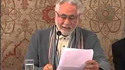
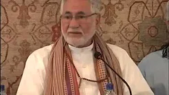

# Sacred Expressions in the Qur'an

On this page, you will find two, slightly older talks given by the Shaykh on some of the more notable sacred expressions in the Qur'an. Before watching the talks, we recommend you spend some time reflecting on the following excerpts from some of the Shaykh's books.

## The Evolving Self    

Every human soul contains the essence of all creation and their meaning. The individual self evolves in consciousness as it experiences creational events and aspires towards the soul’s perfection and its freedom from space-time limitations.  

When self and soul unite at heart, a person experiences a degree of wholeness and contentment in life. The soul transmits pure consciousness and multitudes of admirable attributes, giving hope and purpose to the self. The self of every being is different – specific – and evolves towards the soul. Personal consciousness and the state of body, mind and heart, grow and evolve through life’s experiences towards the soul and higher consciousness. The groomed and mature self submits to the soul and experiences unison and contentment.     

Birth, growth, maturity and death are all activities relating to the self and its material identification along the journey, which starts with one cell growing into a most complex human being. Upon death the self departs from the physical world along with the soul. The evolving self experiences diverse states until it attains the soul’s universal essence. The self’s enlightenment comes with the recognition of its total dependence on, adoration and love of the soul and its creator; the unique everlasting one, who can only be known through his great qualities and created dualities.  

The achievement of harmonious alignment between self and soul is the ultimate purpose of human life. The journey begins with the self’s identification with the body and mind and ends in its union at heart with its soul.  

The self always seeks stimulus, thrill and new discoveries which are all superseded by increased awareness of the perfect moment.

## Spiritual Logic and Worldly Logic  

What is bounded, restricted and delineated is complementary to the boundless and limitless. Infinity is rooted in the tiny entity of an electron or photon. To restrict the self is the first step towards the open horizons of the soul. Many spiritual practices and religions establish laws and boundaries without a clear outer logic or reason, for spiritual logic is totally different to the worldly version. Here you go against the self and its desire where normally you simply try to please the self without reliable satisfaction.  

For spiritual progress we need to apply the opposite logic to that used in worldly growth.  

_From the book “[Witnessing Perfection](../../../books/sufism/witnessing-perfection)”_

**Sacred Expressions - Part 1**

[Watch](https://www.youtube.com/watch?v=Onceeti9Dio)

**Sacred Expressions - Part 2**

[Watch](https://www.youtube.com/watch?v=-2jzm2RCftM)

