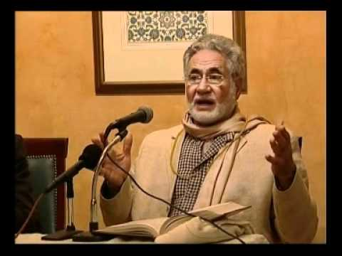
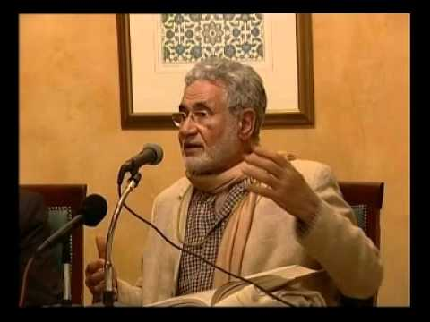
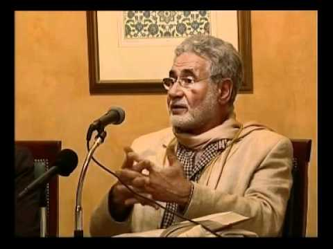

# The Verse of Light - Ayat an-Nur

> Allah is the Light of the heavens and the earth. The example of His light is like a niche within which is a lamp, the lamp is within glass, the glass as if it were a pearly [white] star lit from [the oil of] a blessed olive tree, neither of the east nor of the west, whose oil would almost glow even if untouched by fire. Light upon light. Allah guides to His light whom He wills. And Allah presents examples for the people, and Allah is Knowing of all things. (24:35)

**Part 1**

<a target="_blank" href="https://www.youtube.com/watch?v=TVUYPOk6np4">Watch</a>

**Part 2**

<a target="_blank" href="https://www.youtube.com/watch?v=jAEIDLMHHys">Watch</a>

**Part 3**

<a target="_blank" href="https://www.youtube.com/watch?v=TVUYPOk6np4">Watch</a>

