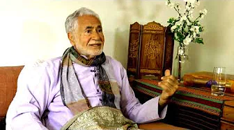

title: IntrRecommendedoduction

description: A collection of talks given by Shaykh Haeri which some more advanced students have recommended for those who are more familiar with the Shaykh's work and teachings.

# Getting Familiar With Shaykh Fadhlalla

This page is intended for more serious students of the Shaykh's who are already familiar with the videos and teachings collected on the [Introduction](../introduction) page. Once you have explored all the videos there, please return to this page and reflect upon these selected talks in which the Shaykh speaks in detail about important and subtle aspects of his work and the tradition of which he is a part.

## The Inseparability of Humanity and Divinity

**Part 1**

[Watch](https://www.youtube.com/watch?v=FqexPtGP60c)

**Part 2**

[Watch](https://www.youtube.com/watch?v=TQNZZW8zhwM)

**Part 3**

[Watch](https://www.youtube.com/watch?v=4QfnfaA5LCQ)

**Part 4**

[Watch](https://www.youtube.com/watch?v=PfG59zEFpGg)

## Duality, Locality and Worldly Wisdom

**Time, Space, and Dualities**

[Watch](https://www.youtube.com/watch?v=-wrWcGk3yTM)

**Locality**

[Watch](https://www.youtube.com/watch?v=O584ub-6OuU)

**Terrestrial Wisdom**

[Watch](https://www.youtube.com/watch?v=cGoW7ivzdFw)

**A Review of the Human Journey**

[Watch](https://www.youtube.com/watch?v=UrbH_90s3fY&list=PLzFr0xRIkb3gVfjRtai2-XBlvWVprgHqP&index=69&t=0s)

**The State of Humanity and Our World Today**

[Watch](https://www.youtube.com/watch?v=kRMTj1yEWIk)

**The Two Aspects of Man**

[Watch](https://www.youtube.com/watch?v=buCr-w7Ezcg&list=PLzFr0xRIkb3gVfjRtai2-XBlvWVprgHqP&index=11)

**Reflections Between Space and Time**

[Watch](https://www.youtube.com/watch?v=7wg8_mXXQ6g&list=PLzFr0xRIkb3gVfjRtai2-XBlvWVprgHqP&index=41&t=0s)

## Perennial, Perpetual Perfection

**Perennial Questions**

[Watch](https://www.youtube.com/watch?v=I2bEoGUt4uk)

**The Perpetual Now**

[Watch](https://www.youtube.com/watch?v=r5PDgtbdyoA)

**The Soul's Access to a Timeless Reality**

[Watch](https://www.youtube.com/watch?v=wmej6TkM25Y)

**The Zone of The Infinite**

[Watch](https://www.youtube.com/watch?v=ZLb8X31B_PY)

## Witnessing Contentment

**Witness! Witness! Witness!**

[Watch](https://www.youtube.com/watch?v=jOH7VkkVxos)

**The Illusion of Liberation**

[Watch](https://www.youtube.com/watch?v=oYU2ivIxczk)

**Seeking Contentment**

[Watch](https://www.youtube.com/watch?v=TQ46eibAy6o)

**The Quest for Contentment**

[Watch](https://www.youtube.com/watch?v=o3Z7sEMCv-E)

If this topic truly interests you, please take a look at this page which is devoted to a series of talks Shaykh Fadhlalla gave on the theme of [Ultimate Contentment](../conversations/ultimate-contentment).

## Light

**Light of Lights**

[Watch](https://www.youtube.com/watch?v=u3CtVfeuaV4)

**Zone of Pure Light**

[Watch](https://www.youtube.com/watch?v=kUlEgsGbk1U)

**He Causes The Night To Enter The Day**

[Watch](https://www.youtube.com/watch?v=6uA4QZ8Owek&list=PLzFr0xRIkb3gVfjRtai2-XBlvWVprgHqP&index=14&t=0s)

**The Soul: A Light Beyond Discernible Light**

[Watch](https://www.youtube.com/watch?v=Qk5oxNUZ4MQ&list=PLzFr0xRIkb3gVfjRtai2-XBlvWVprgHqP&index=62&t=0s)

## True Beams

**Beams of Qur'anic Illumination**

[Watch](https://www.youtube.com/watch?v=tBuYZCsSa34&list=PLzFr0xRIkb3gVfjRtai2-XBlvWVprgHqP&index=64&t=0s)

**Land of Nowhere, Na Kuja Abad**

[Watch](https://www.youtube.com/watch?v=l_LPV9-y5jk&list=PLzFr0xRIkb3gVfjRtai2-XBlvWVprgHqP&index=46&t=0s)

**Are You Ready to Face the Absolute?**

[Watch](https://www.youtube.com/watch?v=YrDrrh5Ol5Q&list=PLzFr0xRIkb3gZ8fH7Ru4Z0aCngiEgt4JJ&index=11)

**He is the First and the Last, the Outer and the Inner**

[Watch](https://www.youtube.com/watch?v=qXAewLnAPw8&list=PLzFr0xRIkb3gVfjRtai2-XBlvWVprgHqP&index=17&t=0s)

If this topic interests you, please consider reading [the full book](../../books/quran/keys-quran) in which many of these beams are described in full detail by Shaykh Haeri.