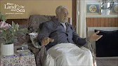

# Start Now

You are a celestial soul or spirit on an earthly voyage exploring duality, yearning for your source and origin of unity.

Human beings are driven to higher consciousness by prayer, meditation and a host of creative pursuits, all of which reflect our yearning to return to a blissful state of contented happiness - paradise. It is ultimately supreme consciousness that we all desire, here and now.

To live fully in presence, we must accept responsibility for their intentions and action. Through submission, we come to realize that the direction of the life-force in human beings is towards experiencing the mysterious grace of Sacred Presence. If there is a purpose in life it is **to know that life is eternal and intrinisically utterly perfect**, irrespective of short term human perception.

**Connection, Continuity, Consciousness**

<a target="_blank" href="https://www.youtube.com/watch?v=XOBffhHNlpc&list=PL-Swj8fEF85K-au1Gawvi118nW6j9qCh2">Watch</a>

**The Purpose of Religion**

<a target="_blank" href="https://www.youtube.com/watch?v=L9kWeKg5ULo&list=PL-Swj8fEF85K-au1Gawvi118nW6j9qCh2&index=2">Watch</a>

**Self and Soul**

<a target="_blank" href="https://www.youtube.com/watch?v=NyR-pKLxXcw&list=PL-Swj8fEF85K-au1Gawvi118nW6j9qCh2&index=3">Watch</a>

**Seeking Contentment**

<a target="_blank" href="https://www.youtube.com/watch?v=TQ46eibAy6o&list=PL-Swj8fEF85K-au1Gawvi118nW6j9qCh2&index=4">Watch</a>

**How Can You Keep Faith In Times of Fear?**

<a target="_blank" href="https://www.youtube.com/watch?v=Dm9nNnuaIhw&list=PL-Swj8fEF85K-au1Gawvi118nW6j9qCh2&index=6">Watch</a>

**Rationality and Spirituality**

<a target="_blank" href="https://www.youtube.com/watch?v=fiwff43WebA&list=PL-Swj8fEF85K-au1Gawvi118nW6j9qCh2&index=7">Watch</a>

**Why Is There Hell?**

<a target="_blank" href="https://www.youtube.com/watch?v=mF8t83iK8es&list=PL-Swj8fEF85K-au1Gawvi118nW6j9qCh2&index=8">Watch</a>

**Wanting to Change the World**

<a target="_blank" href="https://www.youtube.com/watch?v=1kXmg0MilK4&list=PL-Swj8fEF85K-au1Gawvi118nW6j9qCh2&index=9">Watch</a>

