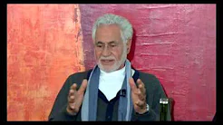
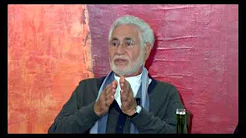
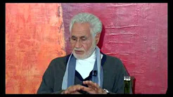
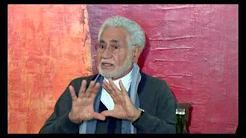
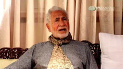
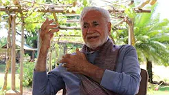
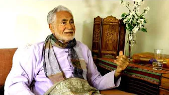
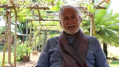
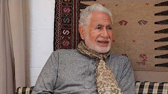
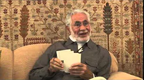

## The Inseparability of Humanity and Divinity

The universe is interconnected at countless levels from the most minute to the galactic. We seek to discern these connections and forces. Consciousness of connections originates from our soul, though it may take physical, chemical, intellectual and other dimensions. From that origin, numerous forces of connectedness emerge, most of which are invisible. The different levels of connectedness and their priorities are understood due to the mind, which is illumined by the soul.

This interconnectedness may be felt through a lived experience of timelessness, along with a total acceptance that the darkness of our temporary state is only understood due to the light of the permanent soul within.

**Part 1**

[Watch](https://www.youtube.com/watch?v=FqexPtGP60c)

**Part 2**

[Watch](https://www.youtube.com/watch?v=TQNZZW8zhwM)

**Part 3**

[Watch](https://www.youtube.com/watch?v=4QfnfaA5LCQ)

**Part 4**

[Watch](https://www.youtube.com/watch?v=PfG59zEFpGg)

## Duality, Locality and Worldly Wisdom

Quieting the mind is achieved only by discipline and proper behaviour, by living according to proper laws that govern all interactions. This is what is called _shari’ah_. So far, what we have been talking about is _haqiqah_, the inner reality: the individual and the secret of beingness and unity. In order to contain and conserve energy, the individual must move within certain boundaries, be governed by certain basic laws. The source of this knowledge is imprinted in the chromosomes of the individual. "Don’t do to others what you don’t want done to yourself." This is the basis of all moral conduct – the basis of all religions before they became tarnished.. Unless we have correct outward behaviour, we cannot change inwardly.

_From the book “[The Sufi Way to Self-Unfoldment](https://zahrapublications.pub/book-TheSufiWayToSelf-Unfoldment.php#bookTitle)”_ 

**Time, Space, and Dualities**

[Watch](https://www.youtube.com/watch?v=-wrWcGk3yTM)

**Locality**

[Watch](https://www.youtube.com/watch?v=O584ub-6OuU)

**Terrestrial Wisdom**

[Watch](https://www.youtube.com/watch?v=cGoW7ivzdFw)

**A Review of the Human Journey**

[Watch](https://www.youtube.com/watch?v=UrbH_90s3fY&list=PLzFr0xRIkb3gVfjRtai2-XBlvWVprgHqP&index=69&t=0s)

## Now Is Eternal
       
Identity relates to mind, memory and time. Thoughts connect the past to the present and future. Reflection, meditation and the silent mind enable us to experience the immense present moment – now.  

We are driven to reduce reduce distance and separation, and to move ever faster. However, it is more effective to stop time altogether. Our human conditioned consciousness drives us towards stillness in mind, which opens the door of timelessness and perpetual presence. All human endeavours lead to a point of experience, which occurs when the mind is content and still. The moment of success or heightened pleasure reflects this state. 

Within the still moment lies the zone of transcendence of mind and time. That is the infinitude of Reality.  

When the past is lost   
and the future is of no concern,    
the perfection of now    
is a great gift   
that yields a lasting thrill. 

      

**Perennial Questions**

[Watch](https://www.youtube.com/watch?v=I2bEoGUt4uk)

**The Perpetual Now**

[Watch](https://www.youtube.com/watch?v=r5PDgtbdyoA)

**The Soul's Access to a Timeless Reality**

[Watch](https://www.youtube.com/watch?v=wmej6TkM25Y)

**The Zone of The Infinite**

[Watch](https://www.youtube.com/watch?v=ZLb8X31B_PY)

**Patience**

[Watch](https://www.youtube.com/watch?v=XbGToVGF4hg&list=PLzFr0xRIkb3gVfjRtai2-XBlvWVprgHqP&index=23&t=0s)

**Land of Nowhere, Na Kuja Abad**

[Watch](https://www.youtube.com/watch?v=l_LPV9-y5jk&list=PLzFr0xRIkb3gVfjRtai2-XBlvWVprgHqP&index=46&t=0s)

## Witnessing Contentment

The nature of the human self is not to accept blame or responsibility. An immature person accuses others when experiencing difficulties, hardship or suffering. However, the evolved person blames themself and takes responsibility for what has gone wrong. A difficulty is regarded as a good lesson. Constrictions can lead to new knowledge and openings. The habit of self-pity and psychological suffering is a great handicap in life. In order to avoid reinforcing suffering, constant watchfulness of the self’s tendency to justify itself whilst blaming others is required.    

When you blame others the ego is protected for a while, but if you blame yourself greater wisdom and fresh insights are the rewards. 

 

**Seeking Contentment**

[Watch](https://www.youtube.com/watch?v=TQ46eibAy6o)

**The Illusion of Liberation**

[Watch](https://www.youtube.com/watch?v=oYU2ivIxczk)

**The Quest for Contentment**

[Watch](https://www.youtube.com/watch?v=o3Z7sEMCv-E)

If this topic interests you, please explore the series of talks Shaykh Fadhlalla gave on the theme of [Ultimate Contentment](../conversations/ultimate-contentment).

## Light

A mature mind can recognize what is transient and changeable and what is more durable. We enjoy the changing seasons and excitement of uncertainty, but our main quest is for what is reliable and constant. A relationship that connects human excitement and stimulation with spiritual stability and tranquillity is a durable relationship.  

There are endless levels of realities and the higher points are near the origin of what is constant and perpetual. Whatever reminds us of the ever-present is generally a desirable state. The ever-changing ego celebrates its perpetual origin, the soul within the heart.

The soul is a reflector of what is eternal and perpetual and enables us to appreciate an experience of eternal Reality.

**Light of Lights**

[Watch](https://www.youtube.com/watch?v=u3CtVfeuaV4)

**Zone of Pure Light**

[Watch](https://www.youtube.com/watch?v=kUlEgsGbk1U)

**He Causes The Night To Enter The Day**

[Watch](https://www.youtube.com/watch?v=6uA4QZ8Owek&list=PLzFr0xRIkb3gVfjRtai2-XBlvWVprgHqP&index=14&t=0s)

**The Soul: A Light Beyond Discernible Light**

[Watch](https://www.youtube.com/watch?v=Qk5oxNUZ4MQ&list=PLzFr0xRIkb3gVfjRtai2-XBlvWVprgHqP&index=62&t=0s)

**Illumination is the Purpose of Human Life**

[Watch](https://www.youtube.com/watch?v=OACoYroXOK0)

  

Discriminating between outer and inner is the first step to realizing their inseparability in essence.

    

You have to be present all the time, visibly, physically, mentally. If you are not, rectify it. You must catch yourself instantly. Do not delay. If you delay you will become fossilized and it will be more difficult. It is all about being available to any situation as a full-grown human being, with faith and good opinion and optimism, with inner realization that you have come from that total ocean of infinity and to that ocean of infinity you are returning. In between is a tiny little flicker!